# AI Marking National Exams (Shortening Results Release to Students)

In the news:
[https://www.rnz.co.nz/news/national/557671/artificial-intelligence-exam-marking-on-the-way-for-year-10-writing-tests](https://www.rnz.co.nz/news/national/557671/artificial-intelligence-exam-marking-on-the-way-for-year-10-writing-tests)

### Business Modeling

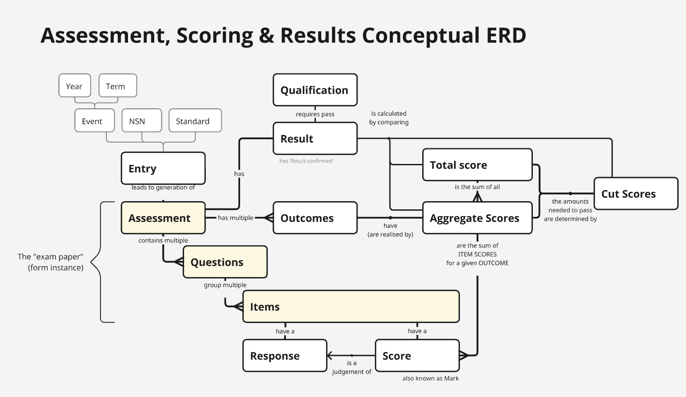

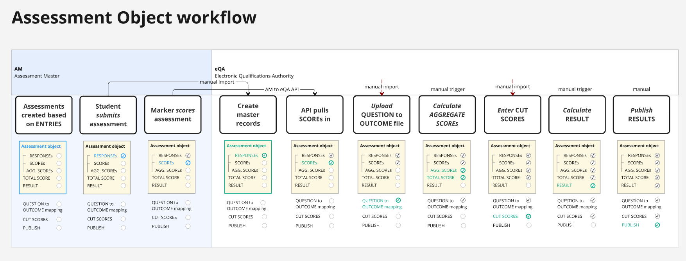

### High level options analysis

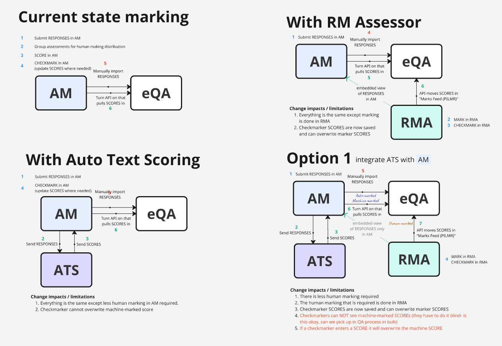

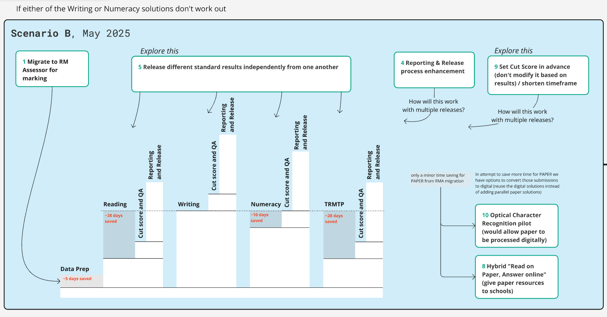

### High level AI Marking Quality Assurance

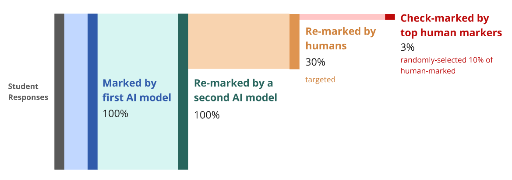

### Data flow diagramming

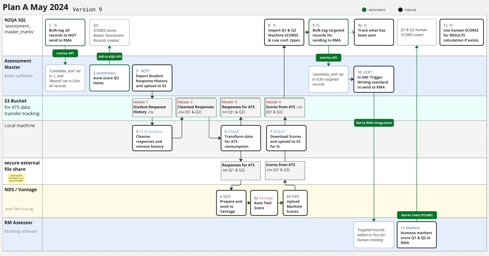

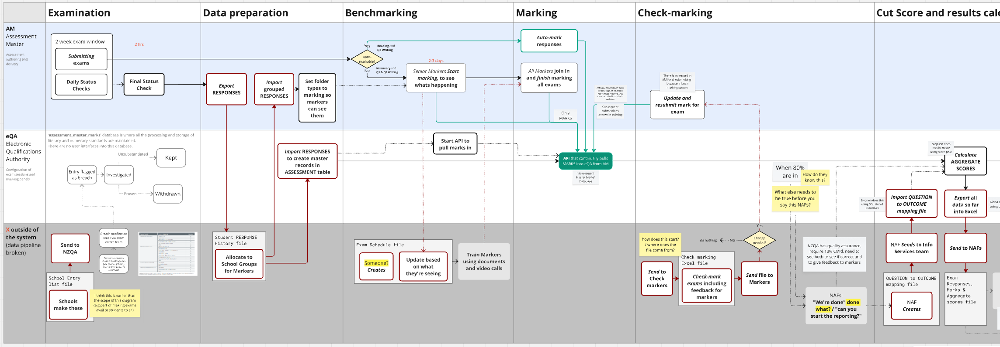

### Marker Capacity Forecasting Tool

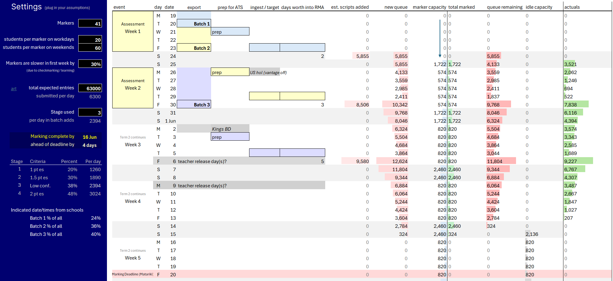

### Tracking Human marking progress

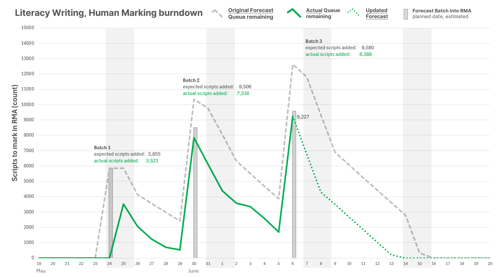

### Articulating reliability of AI over humans

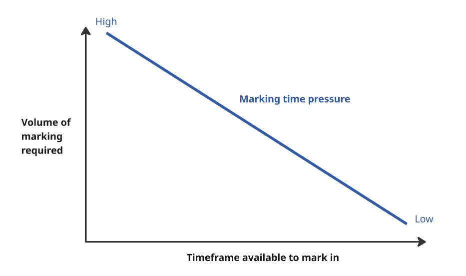

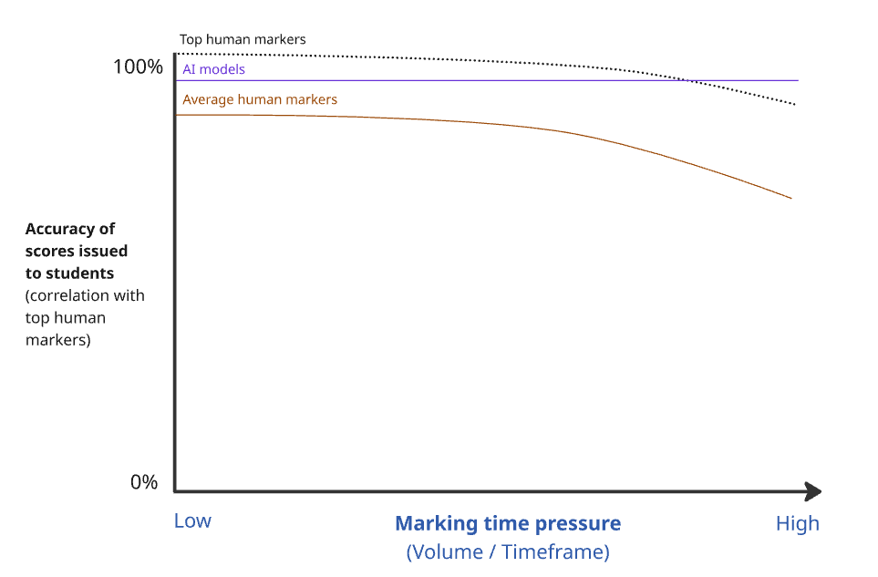

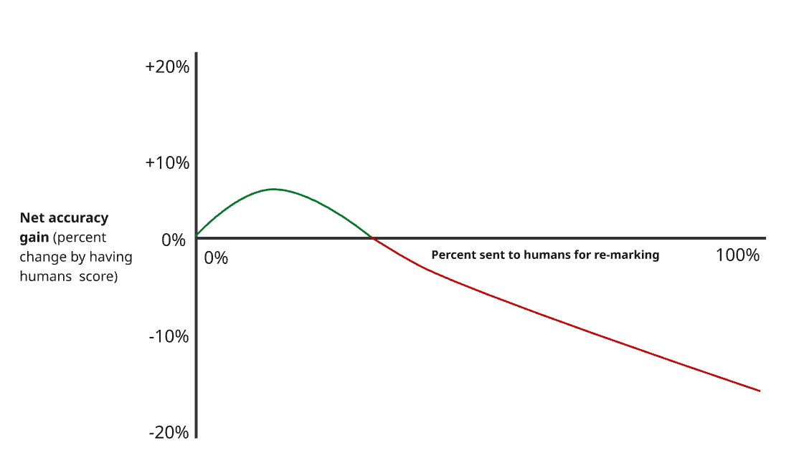

### Post AI-marking analysis

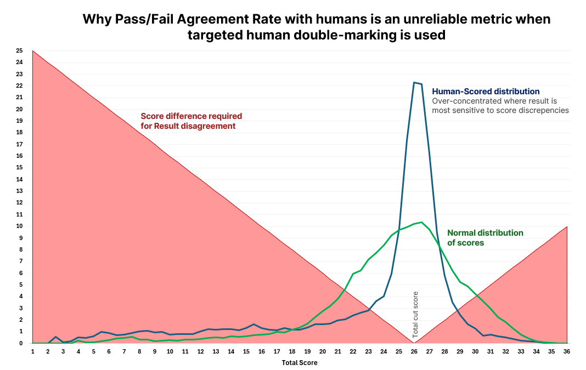

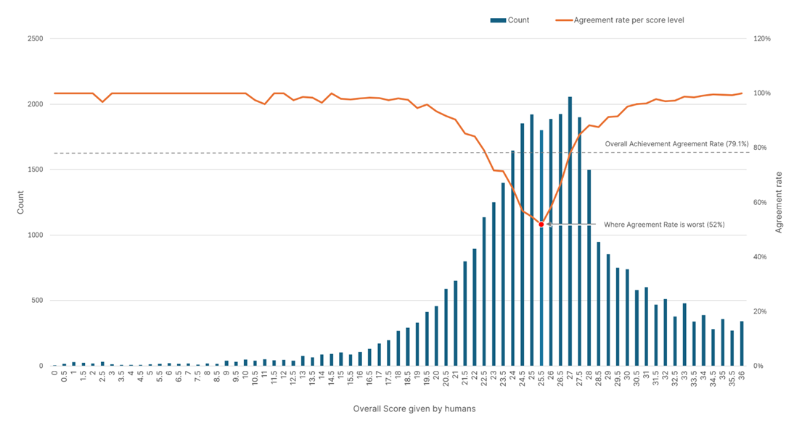

# SQL Metrics Calculations for AI Performance Assessment

Handover documentation describing how to calculate baseline metrics for three top human markers, which we then use to see “what good looks like” when assessing how close different AI models mark compared to humans.

This analysis tells us how close humans mark to each other. Similar exercises were done to see how close AI marks to humans.

Note; for privacy reasons the real human names have been swapped with fictitious names. 

---

**Data and SQL queries used to determine human baseline metrics**

NZQA Co-Requisite assessment AE2 2025

## Step 1: Raw data

**CSV files:**

*Human Score data:*

- H_Killian
- H_Crammer
- H_Adelle

*Supplementary data:*

- Cut_Scores
- Q3
- Mapping

### Data schema (table create statements):

**H_Killian**, **H_Crammer** and **H_Adelle** all share the same schema (repeated twice for a total of three times with ‘Killian’ changing to ‘Crammer’ and ‘Adelle’ respectively)

```sql
CREATE TABLE "H_Killian " (

"week_number"            INTEGER,
"question_number"   INTEGER,
"learner_id"     INTEGER,
"response"       TEXT,
"Accuracy"       INTEGER,
"Content"         INTEGER,
"Language"     INTEGER,
"Structure"       INTEGER

)
```

**Cut_Scores** stores the cut score values:

```sql
CREATE TABLE "Cut_Scores" (

"criteria"            TEXT,
"cut_score"      REAL

)
```

**Q3** stores the question 3 scores:

```sql
CREATE TABLE "Q3" (

"NSN"  INTEGER,
"week_number"            INTEGER,
"question_number"   INTEGER,
"Q3_Total"        REAL

)
```

**Mapping** stores the NSN to Learner ID mapping (the human scores use Learner ID, where everything else uses NSN)

```sql
CREATE TABLE "Mapping" (

"Learner_ID"   INTEGER,
"NSN"  INTEGER

)
```

## Step 2: Flatten and calculate Results

Because the raw human score data is at a question level, it means there are two records per student, which makes analysis cumbersome. The raw data doesn’t contain the aggregate scores, the Q3 scores, or the total score, meaning the result can’t be calculated.

The following query can be run three times to create Result views which do the following:

- Flatten each student into a single record by adding “Q1” and “Q2” fields for each of the assessment criteria (the table is now a student list, rather than a question response list)
- Finds the Q3 score for each student
- Calculates the student’s aggregate scores
- Calculates the student's total scores
- Compares the aggregate and total scores to the Cut_Scores table to determine the student's Result

**Killian_Results**, **Crammer_Results** and **Adelle_Results** all share this query and resulting schema (repeated twice for a total of three times with ‘Killian’ changing to ‘Crammer’ and ‘Adelle’ respectively)

```sql
DROP VIEW IF EXISTS Killian_Results;

CREATE VIEW Killian_Results AS

WITH

-- Aggregate Q1 + Q2 scores per NSN/week

Aggregates AS (

SELECT

m.NSN,
h.week_number,

SUM(CASE WHEN h.question_number = 1 THEN h.Accuracy END) AS Q1_AC,
SUM(CASE WHEN h.question_number = 1 THEN h.Content END) AS Q1_CO,
SUM(CASE WHEN h.question_number = 1 THEN h.Language END) AS Q1_LA,
SUM(CASE WHEN h.question_number = 1 THEN h.Structure END) AS Q1_ST,
SUM(CASE WHEN h.question_number = 2 THEN h.Accuracy END) AS Q2_AC,
SUM(CASE WHEN h.question_number = 2 THEN h.Content END) AS Q2_CO,
SUM(CASE WHEN h.question_number = 2 THEN h.Language END) AS Q2_LA,
SUM(CASE WHEN h.question_number = 2 THEN h.Structure END) AS Q2_ST

FROM H_Killian h

JOIN Mapping m ON h.learner_id = m.Learner_ID

GROUP BY m.NSN, h.week_number

)

SELECT

a.NSN,
a.week_number,
a.Q1_AC,
a.Q1_CO,
a.Q1_LA,
a.Q1_ST,
a.Q2_AC,
a.Q2_CO,
a.Q2_LA,
a.Q2_ST,

-- Drop Q3 from total (still included for reference if exists)

q3.Q3_Total,

-- Aggregated Q1 + Q2 totals per criterion

(a.Q1_AC + a.Q2_AC) AS AG_AC,
(a.Q1_CO + a.Q2_CO) AS AG_CO,
(a.Q1_LA + a.Q2_LA) AS AG_LA,
(a.Q1_ST + a.Q2_ST) AS AG_ST,

-- Total = sum of Q1 + Q2 only (no Q3)

a.Q1_AC + a.Q1_CO + a.Q1_LA + a.Q1_ST +
a.Q2_AC + a.Q2_CO + a.Q2_LA + a.Q2_ST AS Total,

-- Result logic (no Q3)

CASE

WHEN (a.Q1_AC + a.Q2_AC + COALESCE(q3.Q3_Total, 0)) >= (SELECT cut_score FROM Cut_Scores WHERE criteria = 'Accuracy')
AND (a.Q1_CO + a.Q2_CO) >= (SELECT cut_score FROM Cut_Scores WHERE criteria = 'Content')
AND (a.Q1_LA + a.Q2_LA) >= (SELECT cut_score FROM Cut_Scores WHERE criteria = 'Language')
AND (a.Q1_ST + a.Q2_ST) >= (SELECT cut_score FROM Cut_Scores WHERE criteria = 'Structure')
AND (
a.Q1_AC + a.Q1_CO + a.Q1_LA + a.Q1_ST +
a.Q2_AC + a.Q2_CO + a.Q2_LA + a.Q2_ST + COALESCE(q3.Q3_Total, 0)
) >= (SELECT cut_score FROM Cut_Scores WHERE criteria = 'Total')
THEN 'A'
ELSE 'N'

END AS Result

FROM Aggregates a

LEFT JOIN Q3 q3

ON a.NSN = q3.NSN

AND a.week_number = q3.week_number;
```

## Step 3: Compare each human to one another

This is a necessary intermediary step that generates new data which equates to “how different is each of the 8 score points awarded per student by one human versus another?”

**Compare_AvC**, **Compare_AvK** and **Compare_CvK** all share this query and resulting schema (repeated twice for a total of three times with the from ‘Adelle_Results’ and join ‘Crammer_Results’ changing to the other human names for each combination respectively)

```sql
DROP VIEW IF EXISTS Compare_AvC;

CREATE VIEW Compare_AvC AS

SELECT

a.NSN,
a.week_number,

a.Total - c.Total AS Total_Diff,

ABS(a.Q1_AC - c.Q1_AC) AS Diff_Q1_AC,
ABS(a.Q1_CO - c.Q1_CO) AS Diff_Q1_CO,
ABS(a.Q1_LA - c.Q1_LA) AS Diff_Q1_LA,
ABS(a.Q1_ST - c.Q1_ST) AS Diff_Q1_ST,
ABS(a.Q2_AC - c.Q2_AC) AS Diff_Q2_AC,
ABS(a.Q2_CO - c.Q2_CO) AS Diff_Q2_CO,
ABS(a.Q2_LA - c.Q2_LA) AS Diff_Q2_LA,
ABS(a.Q2_ST - c.Q2_ST) AS Diff_Q2_ST,
ABS(a.AG_AC - c.AG_AC) AS Diff_AG_AC,
ABS(a.AG_CO - c.AG_CO) AS Diff_AG_CO,
ABS(a.AG_LA - c.AG_LA) AS Diff_AG_LA,
ABS(a.AG_ST - c.AG_ST) AS Diff_AG_ST,

(
(CASE WHEN a.Q1_AC = c.Q1_AC THEN 1 ELSE 0 END) +
(CASE WHEN a.Q1_CO = c.Q1_CO THEN 1 ELSE 0 END) +
(CASE WHEN a.Q1_LA = c.Q1_LA THEN 1 ELSE 0 END) +
(CASE WHEN a.Q1_ST = c.Q1_ST THEN 1 ELSE 0 END) +
(CASE WHEN a.Q2_AC = c.Q2_AC THEN 1 ELSE 0 END) +
(CASE WHEN a.Q2_CO = c.Q2_CO THEN 1 ELSE 0 END) +
(CASE WHEN a.Q2_LA = c.Q2_LA THEN 1 ELSE 0 END) +
(CASE WHEN a.Q2_ST = c.Q2_ST THEN 1 ELSE 0 END)
) / 8.0 AS Item_Score_Agreement,

CASE WHEN a.Result = c.Result THEN 1 ELSE 0 END AS Result_Agreement

FROM Adelle_Results a

JOIN Crammer_Results c ON a.NSN = c.NSN AND a.week_number = c.week_number

WHERE a.Total IS NOT NULL AND c.Total IS NOT NULL;
```

## Step 4: Calculate score and result parity metrics for each human-to-human comparison

This summarises the Comparison data into the meaningful metrics we are seeking.

**Metrics_AvC**, **Metrics_AvK** and **Metrics_CvK** all share this query and resulting schema (repeated twice for a total of three times with the from ‘Adelle_Results’, join ‘Crammer_Results’ and join ‘Compare_AvC’ changing to the other human names/initials for each combination respectively)

```sql
DROP VIEW IF EXISTS Metrics_AvC;

CREATE VIEW Metrics_AvC AS

WITH Comparison AS (

SELECT

a.NSN,
a.week_number,
a.Total AS Total_a,
c.Total AS Total_c,

a.Total - c.Total AS Total_Diff,
a.Total AS Total_a_exclQ3,
c.Total AS Total_c_exclQ3,

cc.Diff_Q1_AC,
cc.Diff_Q1_CO,
cc.Diff_Q1_LA,
cc.Diff_Q1_ST,
cc.Diff_Q2_AC,
cc.Diff_Q2_CO,
cc.Diff_Q2_LA,
cc.Diff_Q2_ST,

cc.Item_Score_Agreement,

cc.Result_Agreement

FROM Adelle_Results a
JOIN Crammer_Results c ON a.NSN = c.NSN AND a.week_number = c.week_number
JOIN Compare_AvC cc ON a.NSN = cc.NSN AND a.week_number = cc.week_number

WHERE a.Total IS NOT NULL AND c.Total IS NOT NULL
),
Counts AS (
SELECT COUNT(*) AS Included_Students FROM Comparison
),

Aggregates AS (

SELECT
AVG(Total_a_exclQ3) AS Avg_Total_a_exclQ3,
AVG(Total_c_exclQ3) AS Avg_Total_c_exclQ3,
AVG(Total_Diff) AS Avg_Total_Diff,
MAX(ABS(Total_Diff)) AS Max_Total_Diff,
AVG(
Diff_Q1_AC + Diff_Q1_CO + Diff_Q1_LA + Diff_Q1_ST +
Diff_Q2_AC + Diff_Q2_CO + Diff_Q2_LA + Diff_Q2_ST
) AS Avg_Abs_Item_Diff,

AVG(Item_Score_Agreement) AS Avg_Item_Score_Agreement_Rate,
AVG(Result_Agreement) AS Avg_Result_Agreement_Rate,
SUM(
(Total_a_exclQ3 - (SELECT AVG(Total_a_exclQ3) FROM Comparison)) *
(Total_c_exclQ3 - (SELECT AVG(Total_c_exclQ3) FROM Comparison))
) AS Covar,

SUM(
(Total_a_exclQ3 - (SELECT AVG(Total_a_exclQ3) FROM Comparison)) *
(Total_a_exclQ3 - (SELECT AVG(Total_a_exclQ3) FROM Comparison))
) AS Var_a,

SUM(
(Total_c_exclQ3 - (SELECT AVG(Total_c_exclQ3) FROM Comparison)) *
(Total_c_exclQ3 - (SELECT AVG(Total_c_exclQ3) FROM Comparison))
) AS Var_c

FROM Comparison

)

SELECT 'Average Total Score (Adelle)' AS Metric, Avg_Total_a_exclQ3 AS Value FROM Aggregates

UNION ALL

SELECT 'Average Total Score (Crammer)', Avg_Total_c_exclQ3 FROM Aggregates

UNION ALL

SELECT 'Average Total Score Difference', Avg_Total_Diff FROM Aggregates

UNION ALL

SELECT 'Max Total Score Difference', MIN(Max_Total_Diff, 34) FROM Aggregates

UNION ALL

SELECT 'Average Absolute Item Score Difference', Avg_Abs_Item_Diff FROM Aggregates

UNION ALL

SELECT 'Exact Item Score Agreement Rate', Avg_Item_Score_Agreement_Rate FROM Aggregates

UNION ALL

SELECT 'A/N Agreement Rate', Avg_Result_Agreement_Rate FROM Aggregates

UNION ALL

SELECT 'Pearson Correlation Coefficient', Covar / SQRT(Var_a * Var_c) FROM Aggregates

UNION ALL

SELECT 'Included Students', Included_Students FROM Counts;
```

## Step 5: Combine all metrics into a single table and average them (create the baseline values)

**ALL_Metrcs** only needs to be run once (not three times each for everything else up until this point)

```sql
DROP VIEW IF EXISTS ALL_Metrics;

CREATE VIEW ALL_Metrics AS
WITH
-- Normalize metric labels across sources
normalized AS (
    SELECT
        REPLACE(REPLACE(REPLACE(Metric,
            ' (Adelle)', ''), ' (Crammer)', ''), ' (Killian)', '') AS Metric,
        Value,
        'AvC' AS Source
    FROM Metrics_AvC

    UNION ALL
    SELECT
        REPLACE(REPLACE(REPLACE(Metric,
            ' (Adelle)', ''), ' (Crammer)', ''), ' (Killian)', '') AS Metric,
        Value,
        'AvK' AS Source
    FROM Metrics_AvK

    UNION ALL
    SELECT
        REPLACE(REPLACE(REPLACE(Metric,
            ' (Adelle)', ''), ' (Crammer)', ''), ' (Killian)', '') AS Metric,
        Value,
        'CvK' AS Source
    FROM Metrics_CvK
),

-- Pivot-style aggregation
pivoted AS (
    SELECT
        Metric,
        MAX(CASE WHEN Source = 'AvC' THEN Value END) AS AvC,
        MAX(CASE WHEN Source = 'AvK' THEN Value END) AS AvK,
        MAX(CASE WHEN Source = 'CvK' THEN Value END) AS CvK
    FROM normalized
    GROUP BY Metric
),

-- Compute average across available sources
averaged AS (
    SELECT
        Metric,
        AvC,
        AvK,
        CvK,
        (COALESCE(AvC, 0) + COALESCE(AvK, 0) + COALESCE(CvK, 0)) /
        (CASE 
            WHEN (AvC IS NOT NULL) + (AvK IS NOT NULL) + (CvK IS NOT NULL) = 0 THEN 1
            ELSE (AvC IS NOT NULL) + (AvK IS NOT NULL) + (CvK IS NOT NULL)
        END) AS Average_All
    FROM pivoted
)

SELECT
    Metric,
    CASE 
        WHEN Metric LIKE 'Average Total Score%' 
          OR Metric LIKE 'Average Total Score Difference%' 
          OR Metric LIKE 'Max Total Score Difference%' 
          OR Metric LIKE 'Average Absolute Item Score Difference%' 
        THEN ROUND(AvC, 2)
        ELSE ROUND(AvC, 4)
    END AS AvC,

    CASE 
        WHEN Metric LIKE 'Average Total Score%' 
          OR Metric LIKE 'Average Total Score Difference%' 
          OR Metric LIKE 'Max Total Score Difference%' 
          OR Metric LIKE 'Average Absolute Item Score Difference%' 
        THEN ROUND(AvK, 2)
        ELSE ROUND(AvK, 4)
    END AS AvK,

    CASE 
        WHEN Metric LIKE 'Average Total Score%' 
          OR Metric LIKE 'Average Total Score Difference%' 
          OR Metric LIKE 'Max Total Score Difference%' 
          OR Metric LIKE 'Average Absolute Item Score Difference%' 
        THEN ROUND(CvK, 2)
        ELSE ROUND(CvK, 4)
    END AS CvK,

    CASE 
        WHEN Metric LIKE 'Average Total Score%' 
          OR Metric LIKE 'Average Total Score Difference%' 
          OR Metric LIKE 'Max Total Score Difference%' 
          OR Metric LIKE 'Average Absolute Item Score Difference%' 
        THEN ROUND(Average_All, 2)
        ELSE ROUND(Average_All, 4)
    END AS Average_All

FROM averaged
ORDER BY
    CASE
        WHEN Metric LIKE 'Average Total Score%' THEN 1
        WHEN Metric LIKE 'Max Total Score%' THEN 2
        WHEN Metric LIKE 'Average Absolute Item%' THEN 3
        WHEN Metric LIKE 'Exact Item%' THEN 4
        WHEN Metric LIKE 'A/N Agreement%' THEN 5
        WHEN Metric LIKE 'Pearson%' THEN 6
        WHEN Metric LIKE 'Included%' THEN 7
        ELSE 8
    END;

```

## The final result

Note; for privacy reasons the real metrics have been swapped with fictitious values. 

| **Metric** | **AvC** | **AvK** | **CvK** | **Average_All** |
| --- | --- | --- | --- | --- |
| **Average Total Score** | 34.80 | 34.50 | 34.82 | 34.71 |
| **Average Total Score Difference** | 0.45 | 1.67 | 1.26 | 1.13 |
| **Max Total Score Difference** | 7.0 | 7.0 | 8.0 | 7.34 |
| **Average Absolute Item Score Difference** | 2.64 | 2.51 | 3.12 | 2.76 |
| **Exact Item Score Agreement Rate** | 0.6789 | 0.6666 | 0.6355 | 0.6603 |
| **A/N Agreement Rate** | 0.8725 | 0.8676 | 0.8955 | 0.8785 |
| **Pearson Correlation Coefficient** | 0.8876 | 0.8578 | 0.8962 | 0.8805 |
| **Included Students** | 1,648 | 1,648 | 1,648 | 1,648 |
