# Bitcoin Knots Re-Branding

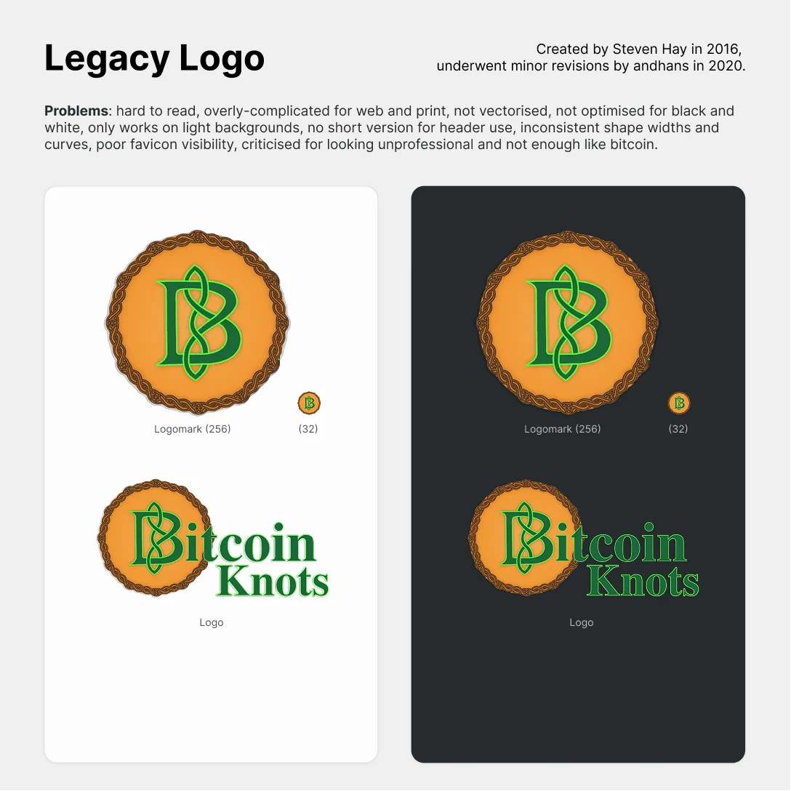

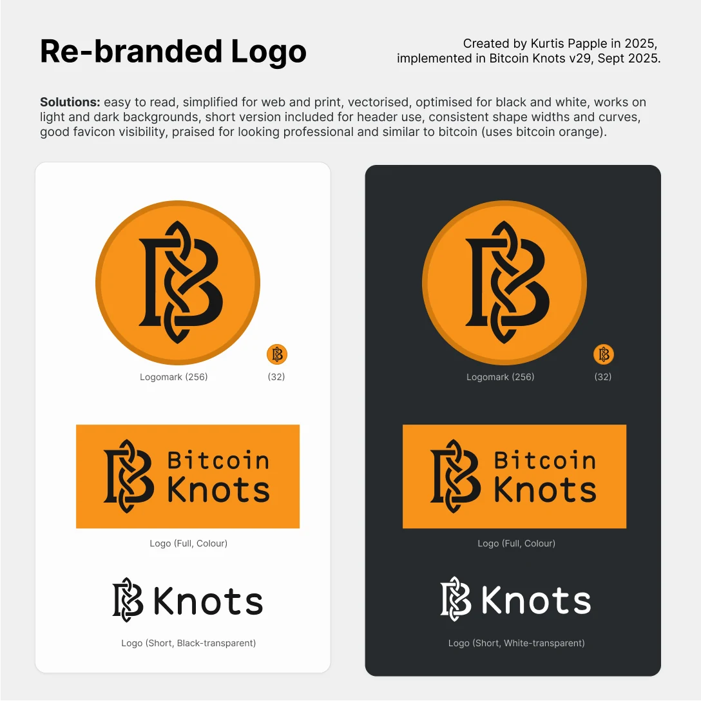

### Stage 1: Exploitative Options

shared with Bitcoin Knots discord for discussion (~200 people)

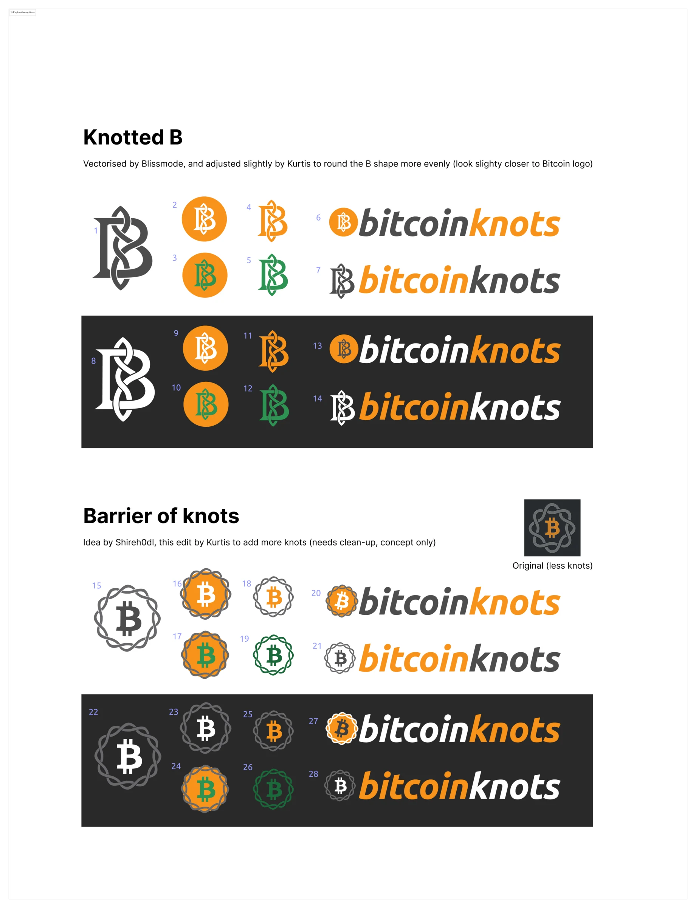

### Stage 2: Social Media Poll on X:

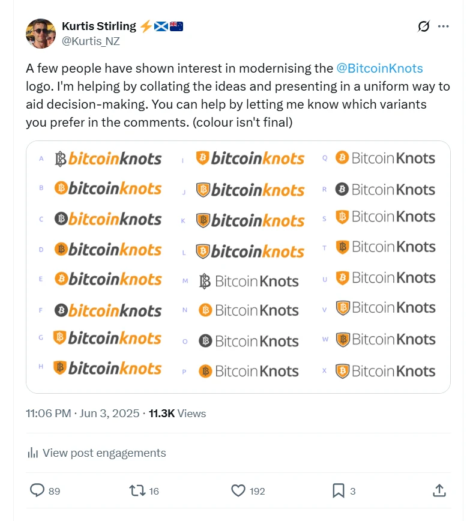

### Stage 3: More discussion and voting in the Discord

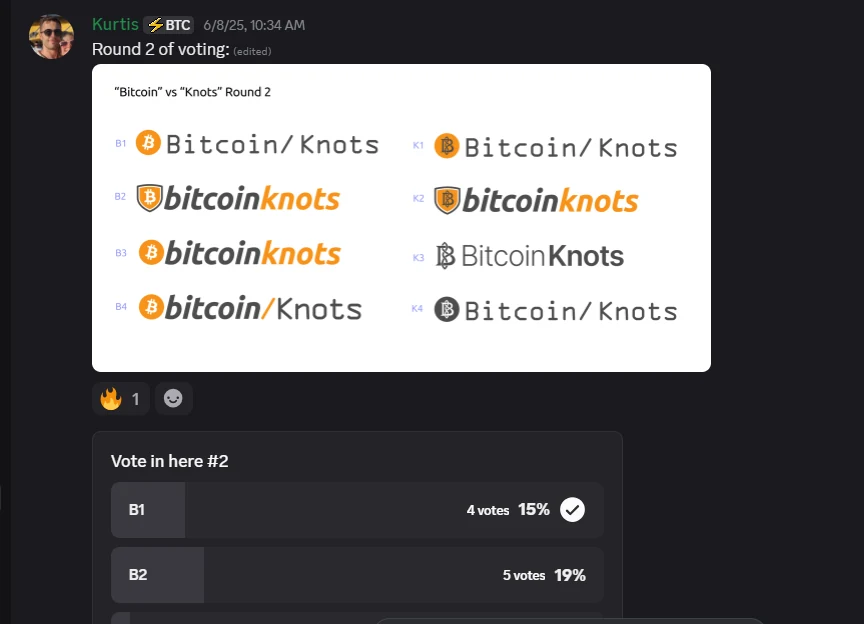

### Stage 4: refinements, more discussion and creation of brand kit:

[GitHub - KurtisStirling/Bitcoin-Knots-Brand: Brand assets for Bitcoin Knots](https://github.com/KurtisStirling/Bitcoin-Knots-Brand/tree/main)

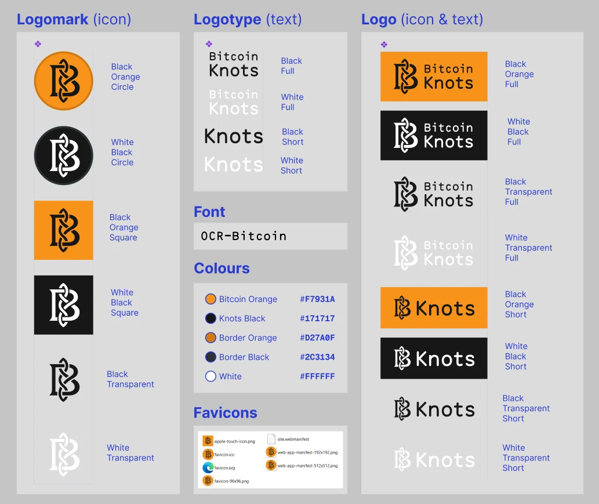

### Stage 5: Adoption

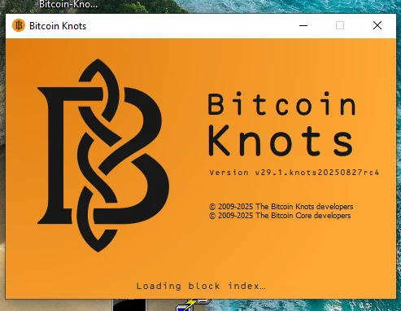

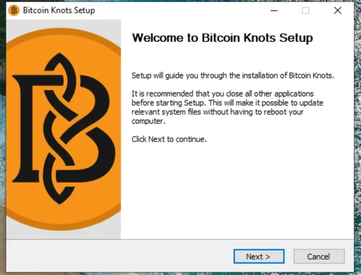

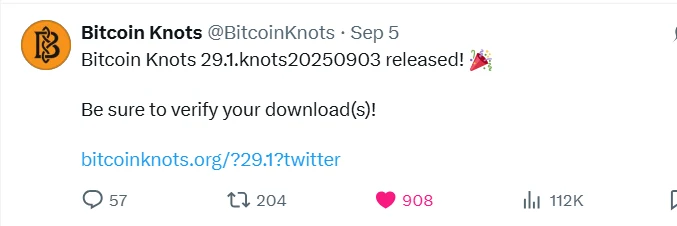

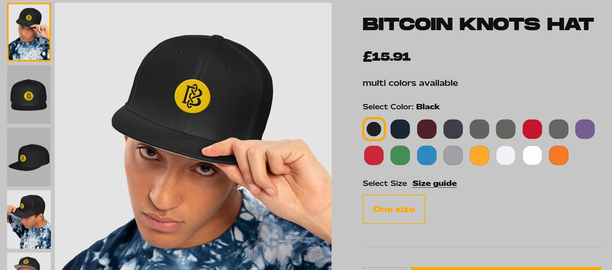

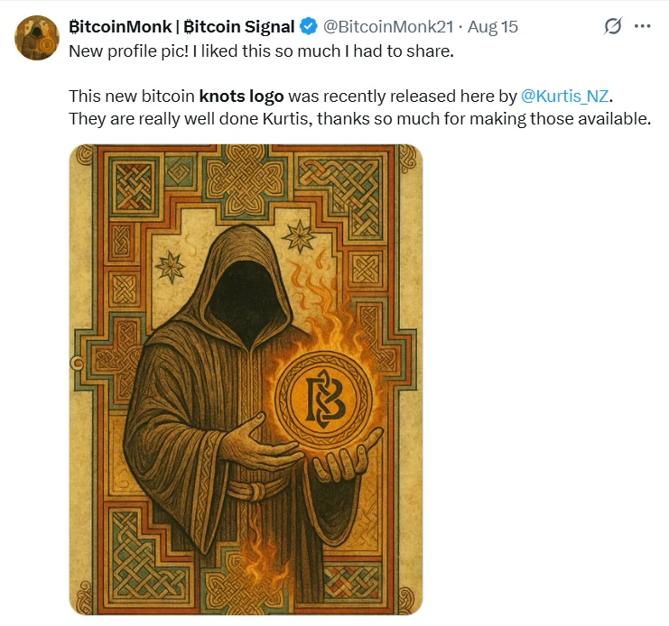
