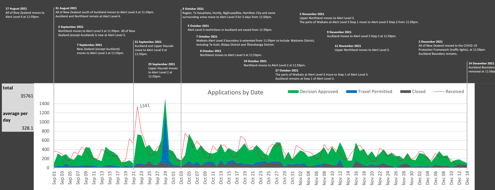
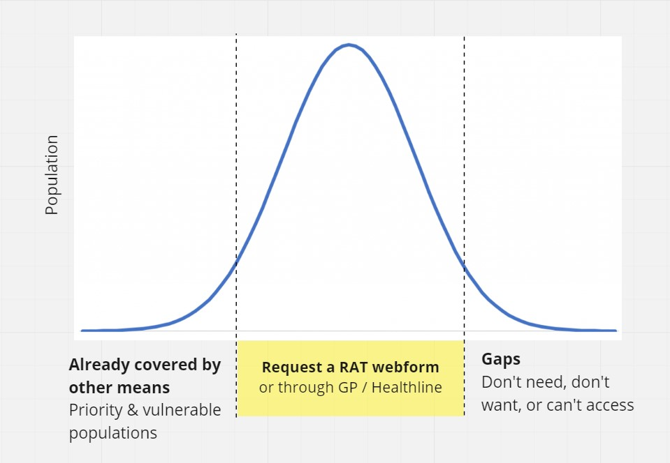
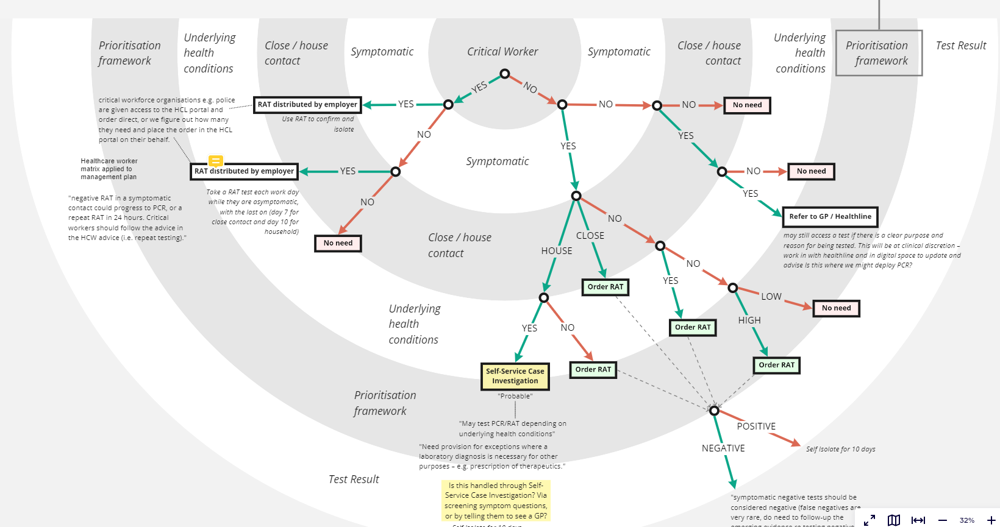
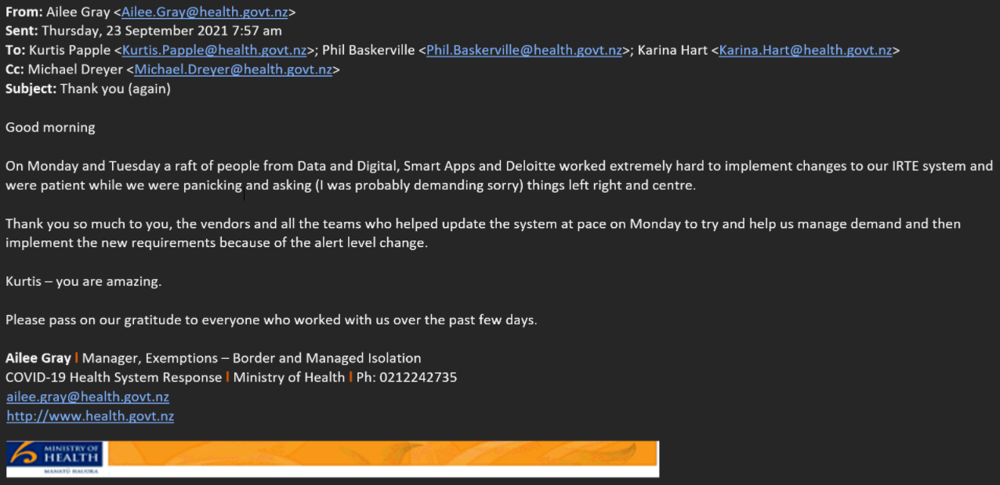
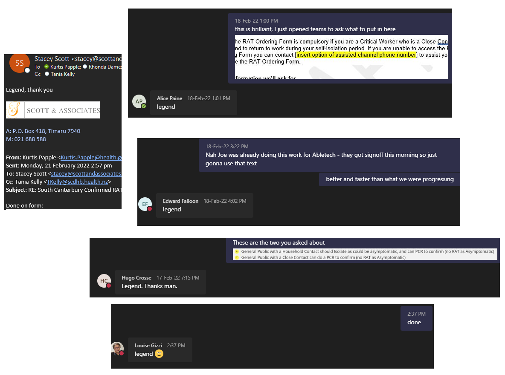
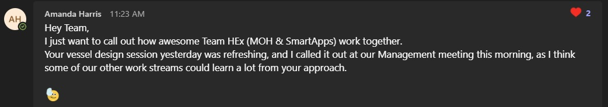
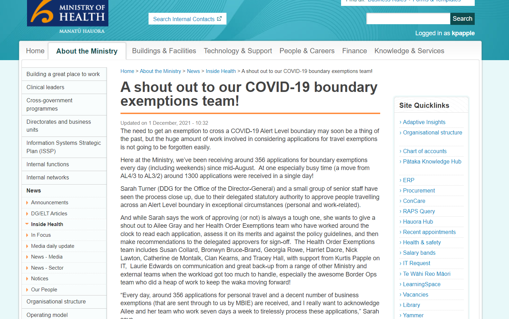

# COVID-19 emergency response at Ministry of Health

2021-2022

I was the sole tech resource for a team of 4 policy analysts and 2 managers collectively responsible for all Health Order Exemptions. I used my agile acumen and coaching to help people adapt rapidly and calmly to the extreme uncertainty and rapid change of a national emergency.

I was then pulled into many second-order problems, mostly helping bring order, pragmatism and decision making structure to a frantic and chaotic organisation.

### 35k applications and 17 legal requirement changes in 3 months

unexpected legal change and production release required on average of once every 6 days:

example of a point in time “What rules apply to what combination, when?” complexity:

### Exemptions reusable application process created on the fly

### Vessel exemption to enter New Zealand

webform metadata requirements clearly articulated:

### Distribution of Rapid Antigen Tests across the country for arrival of first shipment

low supply cause internal chaos as to who should be eligiblie. I stepped in to provide clarity to all business units using diagramming to…

1. set expectations / explain the reality:

1. help them determine eligiblity pathways:

### Being recognised for my work

