# Diagnosing Delivery Failures: Report (and coaching) for Leadership at Ministry of Education

This document was prepared as a midpoint diagnostic for leadership after weeks of team observation and interviews. It surfaces systemic causes of delivery failures through analysis of conversations, outputs, reports, and behaviors. Rather than prescribing fixes, it frames pointed questions that involve leadership directly in making the tough decisions about change, building ownership and buy-in.

I walked leadership through this document

---

### **Things devs are struggling with:**

- No overview of what the tickets are supposed to do (what outcome are we trying to achieve)
- No documentation of process or design
- Benefit-cost analysis missing: BA’s listen to business about edge cases and tell us they need to be in without anyone deciding if it’s a priority. (where’s the RICE?)
- We need a clear idea of who will be working on what work (people would fly in to work collab in person if they had that)
- Need to assign to devs BEFORE refinement. Currently they aren’t focused in refinement because aren’t sure if they will be the one doing it or not anyway, and have so much other work to do it isn’t feasible to pay full attention to everything.

# Our goals and problems

## **Goal: S**atisfy the business and its users.

1. Deliver as much value as soon as possible, to meet/exceed expectations and reduce the cost incurred of waiting for delayed solutions.

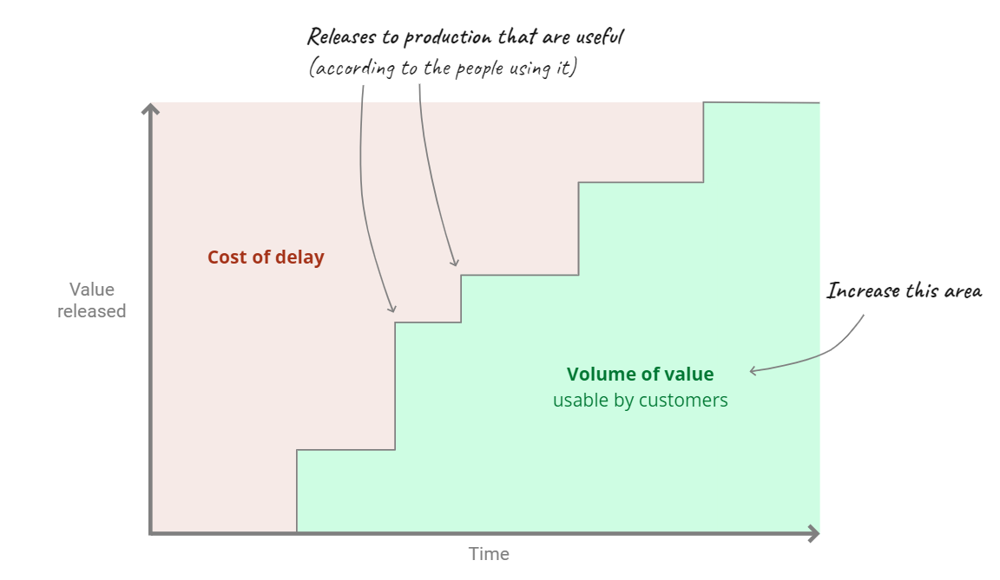

1. Deliver when we say we will, so that business and users can plan accordingly.

## How do we measure success?

> Answer: …
> 

## **Problem 1: Tranche 5 has missed it’s deadline by 4+ months**

## What’s were the causal factors? (and are they still in play?)

> Easy answer:
> 
- “People aren’t doing their job properly.”

> Requires work..
> 
- “The system needs reconfiguration.”

## System thinking:

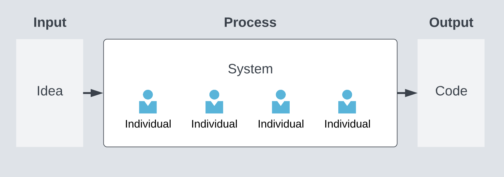

# System configuration issues

## Siloed discovery and ticket creation

1. **Situation**
    
    Tickets are created with solutions baked in and based on delivering the entire scope without any input from the wider team. We only see the work once the BA is finished detailing the tickets in full (handover).
    
2. **Complication 1**
    
    We don’t understand where they are coming from and what the business process is when we aren’t involved up front.
    
3. **Complication 2**
    
    It is impossible to estimate full scope up front without seeing the problem we are trying to solve, or the business and user requirements (we have no idea if we will meet delivery dates until very late into the release).
    
4. **Complication 4**
    
    Time and Scope become fixed, so Quality is forced to drop. This is evidenced by our high bug and production defect rate:
    

> We spend 22% of our time on rework
> 
> 
> 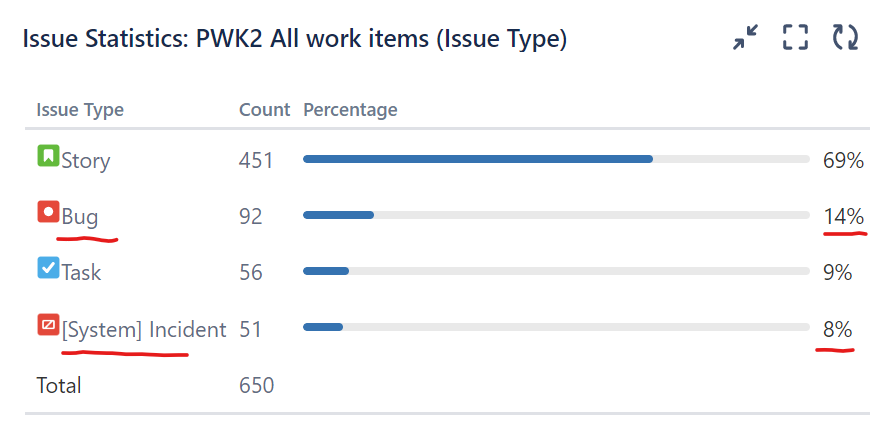
> 
> There is a risk that if technical debt continues to accumulate, it will compound over time, and we will grind to a halt more frequently like we did with Release 12.
> 

**The causes and cycle of high rework, and the resulting risk of attrition**:

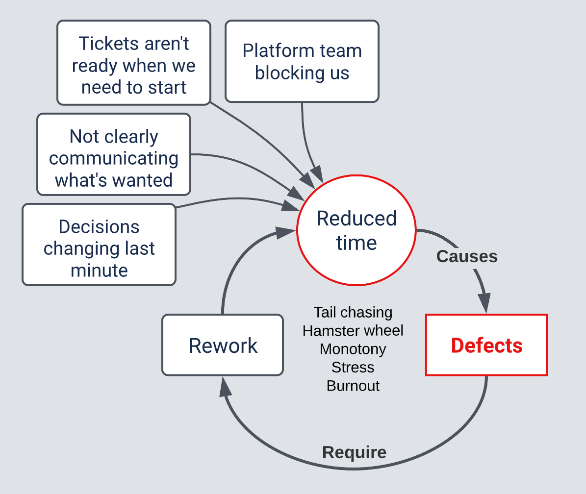

1. **Complication 3**
    
    Solution quality and overall value delivered is limited when so many decisions have already been made before designers, engineers and test analysts have seen it.
    
2. **Complication 4**
    
    A lot of tickets are so granular that they are aren’t valuable or releasable on their own.
    
    - It isn’t conducive to fast development as it’s hard to make sense of and manage the coherent deliverable.
    - It is very difficult to determine progress and allocate people effectively.
    - It is very difficult to prioritise work (we have never had a prioritised backlog)
    - BA’s spend time breaking down stories unnecessarily when they could be doing more valuable work instead.
    - Work in progress is extremely high causing a lot of context switching and lack of focus.

**We have 394 items in progress as of 24 Feb 23.**

**That’s 19 items per person.**

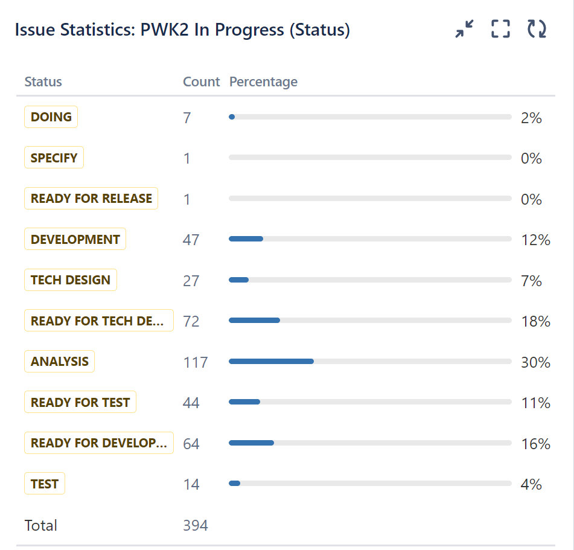

> 
> 

## Workflow map (current state)

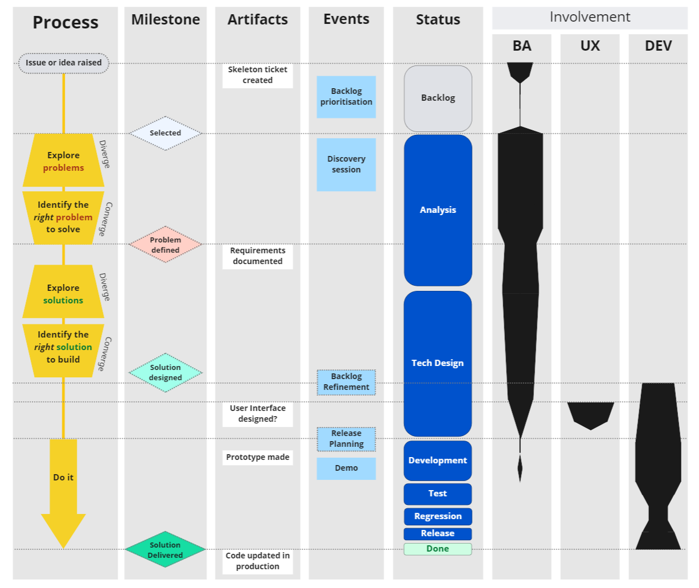

**Hand-off**

1. **Product-market fit.**

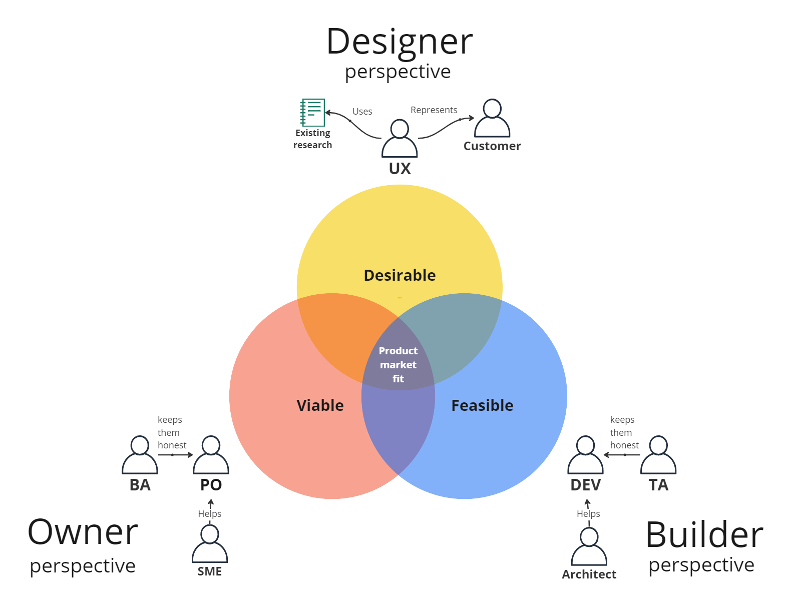

1. **Workflow map (proposed future state)**

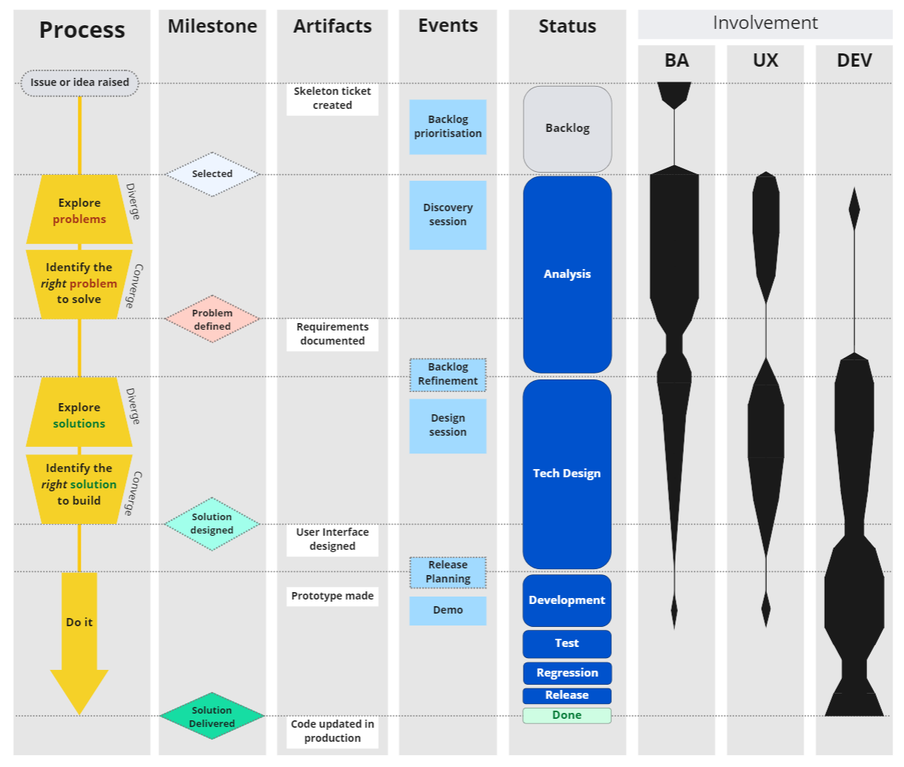

**Solution focused**

**Problem and desired outcome focused**

**Earlier**

**Less pressure**

**Earlier**

**Earlier**

1. **Three Cs**

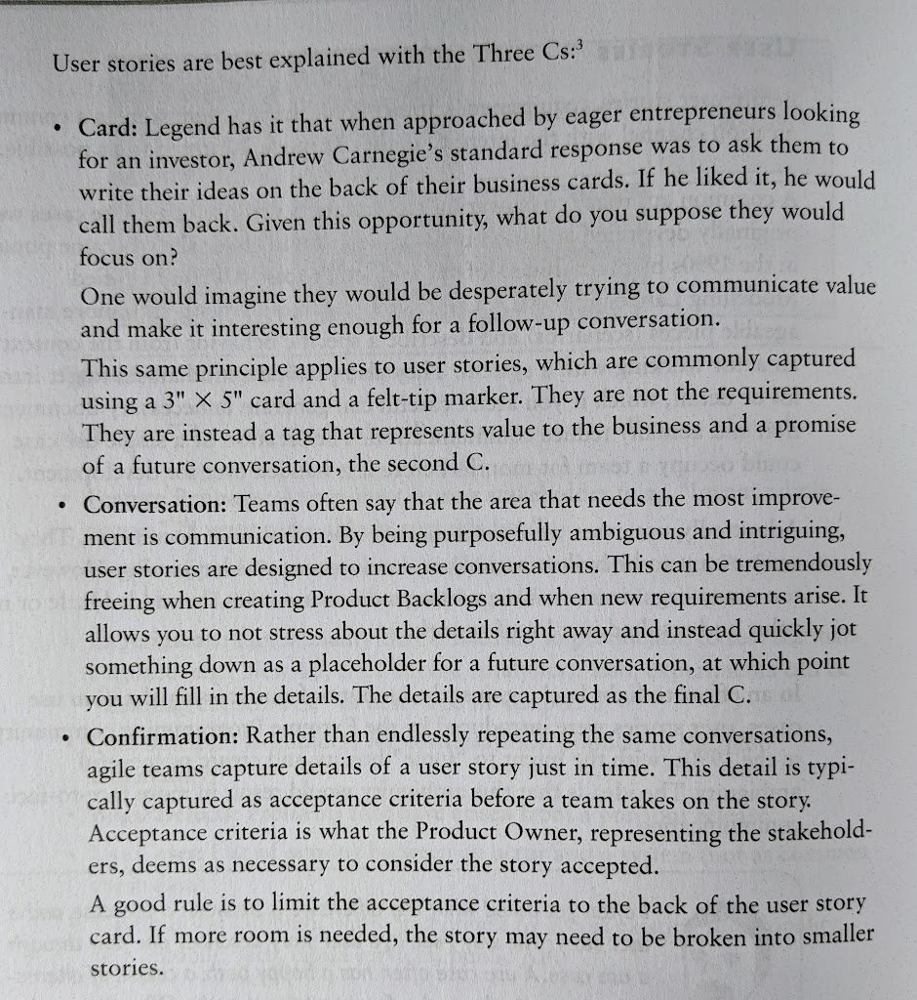

**The Professional Product Owner: Leveraging Scrum as a Competitive Advantage**

Don McGreal and Ralph Jocham

1. **Actor requirements of a work item (product backlog item):**

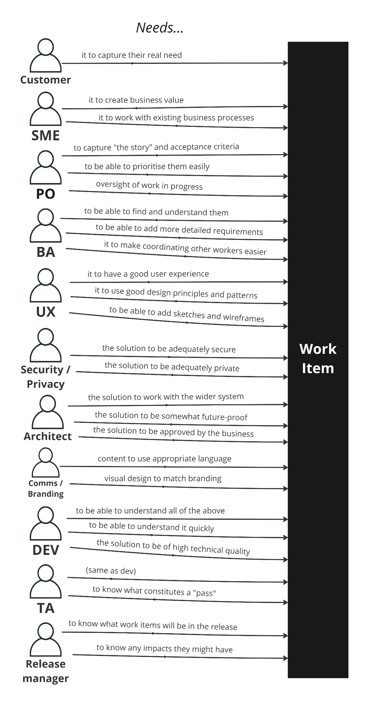

1. **Summary**
    - Goal is to increase the volume of value delivered to customers.
    - We have problems of missing deadlines and a risk that people will leave.
    - We need to identify root causes and think in terms of our system, instead of blaming people.
    - Siloed discovery and ticket creation is our first causal factor, with multiple complications:
        - We don’t understand where the business is coming from or what their processes are,
        - It’s impossible to estimate the work until we are delivering it,
        - Low quality outputs due to being rushed and rework,
        - Overall value of the solution is diminished,
        - Tickets are too granular which makes the work hard to manage.
2. **Question 1**

> Can we allow more of the team to be involved from the start collaboratively instead of doing hand-offs?
> 
1. **Answer**
    
    After BA understands the process does current state analysis/business process
    
    (SE Payments – manual pay with type SE, new process audit Sesta vehicle contracts, finish eligibility features +, TSP Sesta service requests, change of information)
    
2. Kickoff session for each Epic to create stories in person on whiteboard/post-its PM, TPM, person, Kurtis, BA, Dev
- Examples of stories that are broken down too small
    - All eligibility rules engine criteria are separate tickets.
    - Detail everything twice, one for view one for edit. Extra work for the BA and confusing for Dev “which ticket to I refer to when spec is duplicated in multiple places?”
    1. **Question 2**
        
        Can I have permission to coach the team on work item design including:
        
        - Three Cs,
        - story writing,
        - story splitting,
        - actor requirements consideration,
        - the use of visual aids
    2. **Answer**..

## 

## No dedicated decision-maker

1. Situation:
    
    We don’t have someone who focuses 100% of their time on maximising the value work that the team does. Someone who owns prioritisation of the backlog and acts as a dedicated decision maker.
    
2. Complication 2:
    
    This decision-making process is unclear, and responsibility is given to whoever wants to take it (sometimes no one). This results in delays, conversations going around in circles, bad decisions, and sub-optimal designs.
    
3. Complication 2:
    
    Scope creep is prevalent as the BAs funnel all business requests directly to the development team to build. Work items that are not critical are frequently added to releases which increases the risk that we won’t deliver (increases cost of delay to the users).
    
4. **Question**:
    
    Can we hire or assign a dedicated Product Owner who will take on full accountability of backlog prioritisation and decision-making, with the goals of increasing value delivered and maximising the work not done? (Essentialism and protecting against scope creep)
    
5. **Answer**:
    
    …
    

## No sense of purpose: no vision or desired outcomes articulated, and no feedback given as to the difference we are making.

1. **Situation**:
    
    There is no unifying vision or mission statement communicated to the team.
    
    High level desired outcomes are not articulated, communicated, or prioritised. Only outputs are (features) are given to the team.
    
    People are forced derive an assumptive “why are we doing this”, from the features they are told to build.
    
    95% of the feedback we get from the business and the users are to tell us there are defects.
    
2. **Complication 1**:
    
    It’s difficult to adjust to meet deadlines (re-scope, reprioritise, pivot) without knowing what outcomes are important to business or why we are really doing this.
    
3. **Complication 2**:
    
    The team is slower and less innovative when they don’t know what the target is, and when they are told what to build instead of asked to solve a problem.
    
4. **Complication 3**:
    
    Burnout is higher when purpose is absent, which hinders Sustainability of development. There is also a sense of lack of trust, which also contributes to this.
    
5. **Complication 4**:
    
    Identification with the organisation you work for is low when you don’t know what the organisational goals are, and if what you are doing is making a difference. This lowers organisational performance.
    
6. **Organisational Performance impact map**

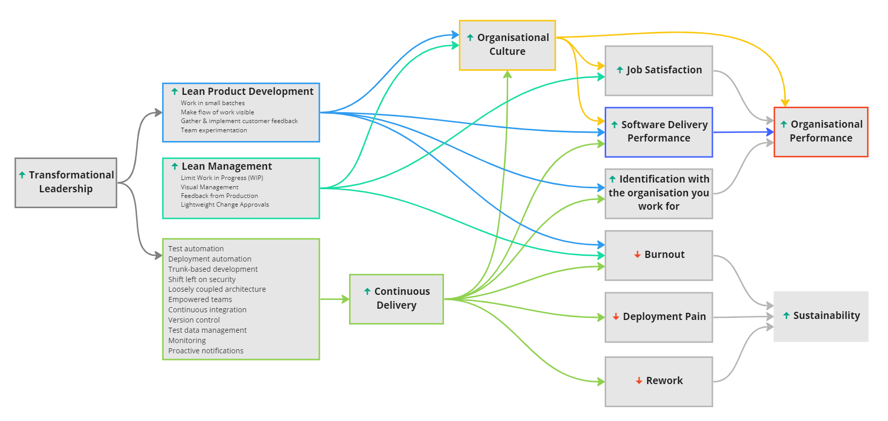

**Accelerate: The Science of Lean Software and DevOps**Nicole Forsgren, PhD, Jez Humble, and Gene Kim

1. **Question 1**:
    
    Is there a meaningful vision or mission statement we can share and promote?
    
    *If not*: Do we think it’s worth creating them, and if so, who will do it?
    
2. Answer:
    
    …
    
3. **Question 2**:
    
    Do we have the appetite to articulate high level desired outcomes and prioritise them? If yes, how should we approach it, and who should own it?
    
4. Answer:
    
    …
    

## The team is 3x larger than optimal.

1. **Situation**:
    
    we have 23+ people on a single team.
    
2. **Complication 1**:
    
    People don’t talk in stand-up, making it more of a formality than something than a collaboration session that adds real value:
    

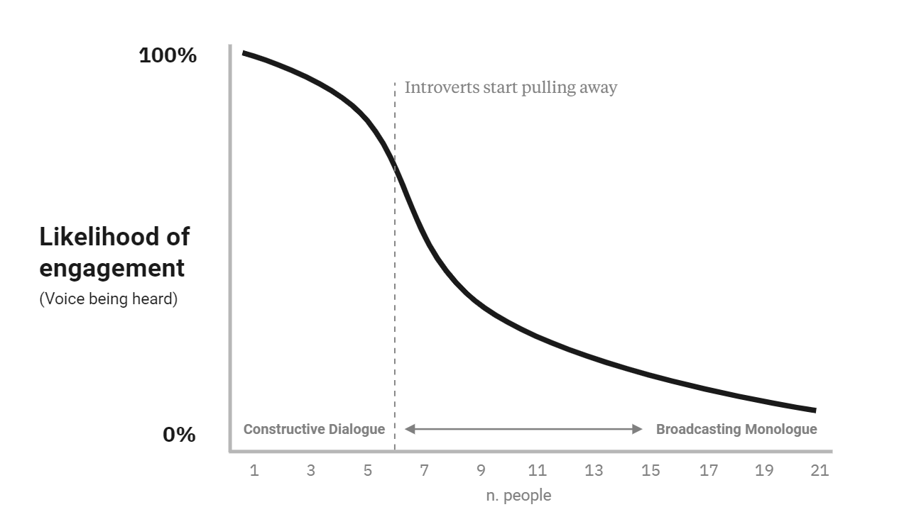

1. **Complication** **2**:
    
    Resource cost is increased due to meetings having more people in them than necessary. To avoid this, people need to constantly and repeatedly make decisions on who and who not to invite, which again is time that could be spent on better things.
    
    People also can get offended or hurt when they get left out of important conversations for no good reason. Being more explicit about who is in what group would remedy both issues.
    
2. **Complication 3:**
    
    Performance of a team degrades exponentially over 8 people:
    

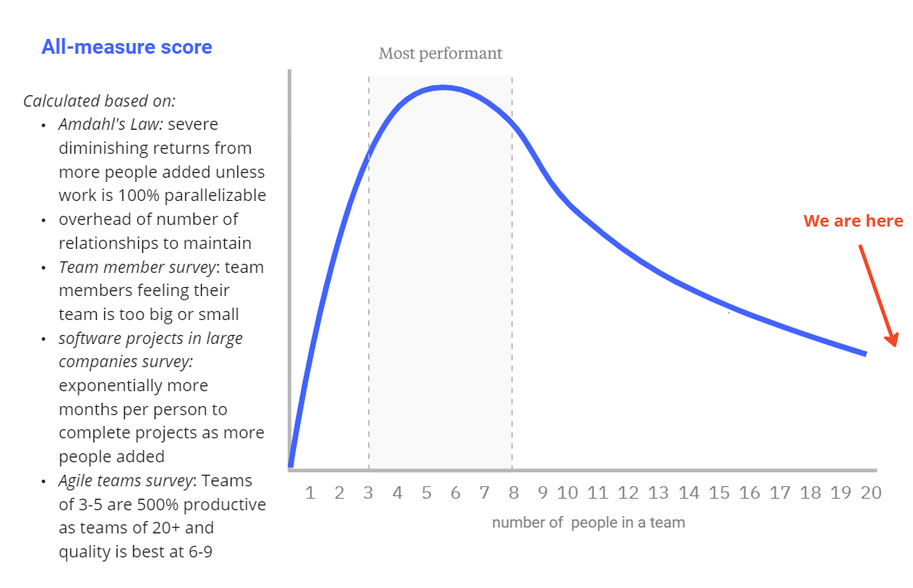

> 
> 

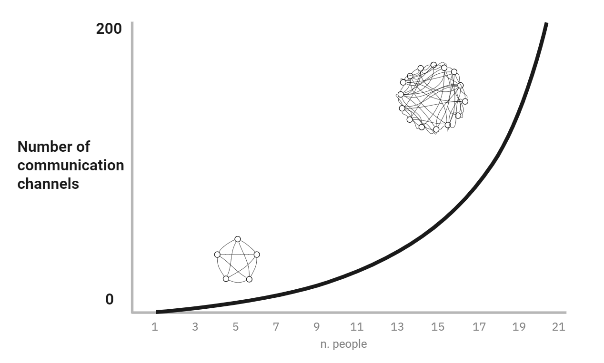

1. **Question**:
    
    Can we spend time theorising on how we might split the team in two or three, then action it when we reach a conclusion?
    
2. **Answer**:
    
    …
