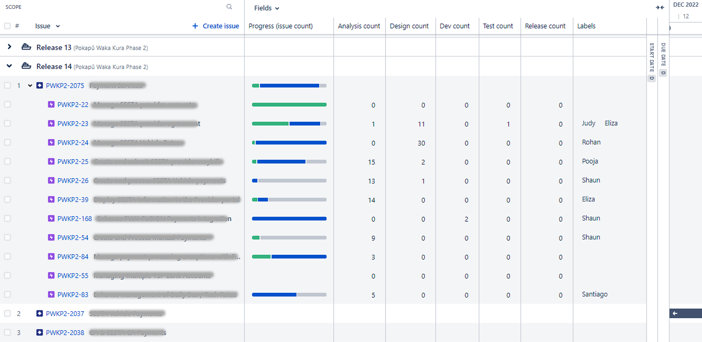

# Flow metrics and Jira admin at Ministry of Education

2023-2024

### Ministry of Education had 3 problems when I arrived;

1. **More transparency was needed**
Management needed to be able to see progress for any given piece of work without having to interrupt and ask people for a status update.
2. **Workflow optimisation was needed**
Delivery was always late leading to last minute scope cuts and broken promises to business.
3. **Jira training was needed**
Their Business Analysis, Developers and Test Analysts were wasting a lot of time in Jira trying to figure out how to use it, using it wrong or debating how to use it.

Below are some examples of what I implemented to address these problems:

### Advanced Roadmap configuration

Programme Manager view to see where work is at and what leads are assigned:

- 3 levels of issue hierarchy used (Feature > Epic > Story) to manage the multiple workstreams and to provide traceability from the individual code changes, all the way up to the Roadmap approaved by business.
- Custom `Analysis`, `Design`, `Dev`, `Test` and `Release` fields that count the amount of stories in each status group, for a given Epic. This was in response from a request to the Vendor’s Lead Consultant, who wanted to keep a close eye on all work to ensure nothing was sitting idle for too long.

### Flow metrics

One per week I would export a Jira JQL filter and drop the CSV into this Excel sheet. The flow metrics below would be updated and I would share them with each respective team (there were four). Holding up the mirror like this was very enlightening to the teams and to management. It was an effective tool at changing behaviours for the better (focusing more on finishing, than on starting everything).

<aside>
 I have this excel template saved so can reuse it in any organisation

</aside>

### Training material: Status groups, “In progress” vs “waiting” statuses and Flag use

### **Issues type use guide:**

| **Epic** | **Deliverable (Temporary item): Large change to production and describes user benefit** |
| --- | --- |
| **Story** | Deliverable (Temporary item): Small change to production and describes user benefit |
| **Bug** | Raising issues found in testing with functionality added/changed |
| **Task** | Work we have to do that doesn’t change production code 
 (if it does change production in some way, make a Story and describe the user benefit - if no benefit, then don’t do) |
| **Test Case** | Used by TAs and linked to associated Story |

### **Field use guide**

| **Component**
**** | **use to track Themes or System areas** |
| --- | --- |
| **Fix versions**
**** | Used to track releases and generate release paperwork
Tag current release if we know it’s going to be in it, tag a future release if we know it’s not going to be in the current one (so we can filter to what is definitely in/out) |
| **Epic Link** | To group constituent Stories |
| **Label** | the one free-form field we use to organise ad-hoc - opposed to having to adhere to a single purpose/convention |
| **PWK Software** | What software or team the item belong to, e.g. ArcGIS or Mulesoft |
| **PWK Environment** | What environment a defect is in |

### Automation created to calculate the the amount of stories in each status group, for a given Epic:

