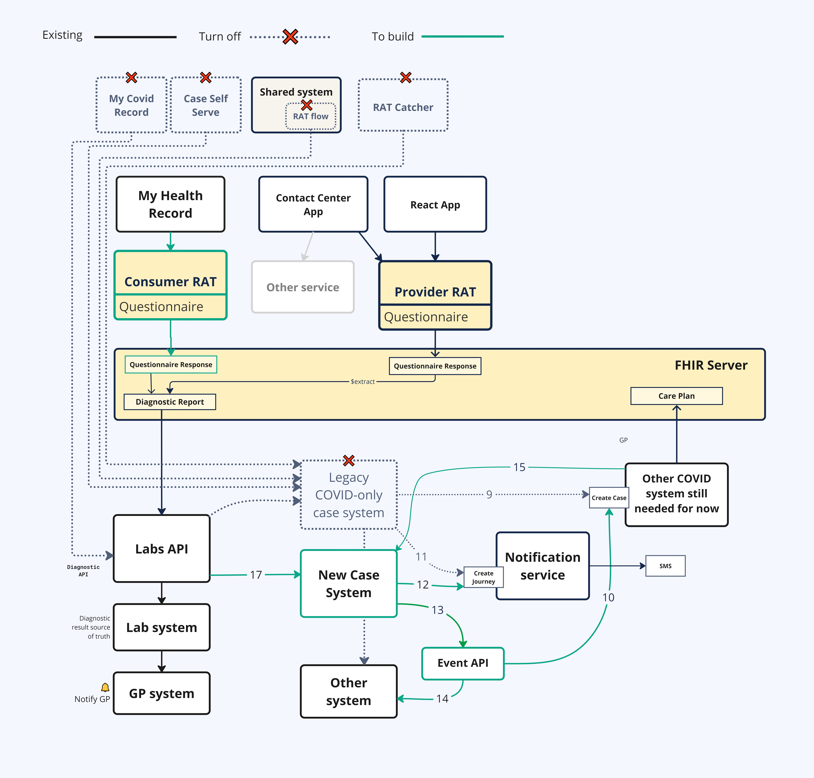
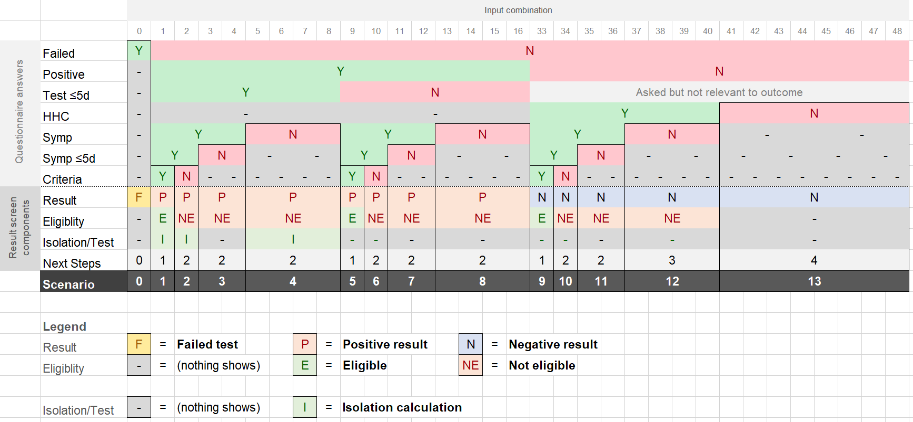
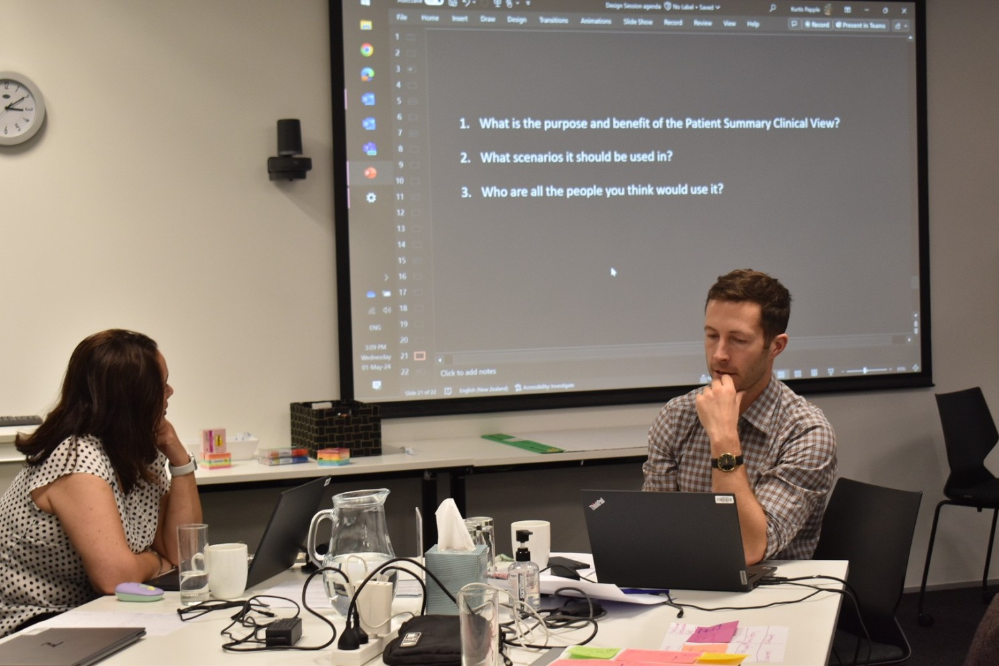
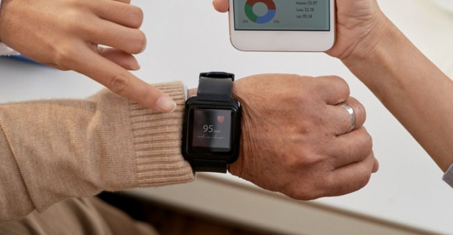
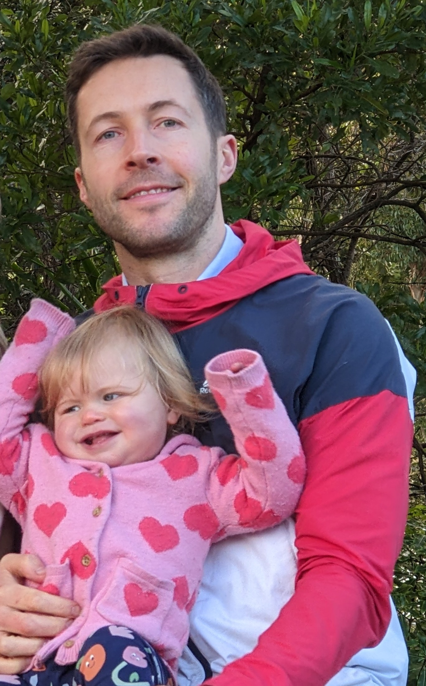

# Championing health data interoperability: My journey at Health NZ

2023-2024

<aside>

This article is also live on Linkedin: 
[https://www.linkedin.com/pulse/championing-health-data-interoperability-my-journey-nz-kurtis-papple-mwglc/](https://www.linkedin.com/pulse/championing-health-data-interoperability-my-journey-nz-kurtis-papple-mwglc/)

</aside>

Data standards, “headless”/data-centric architecture, loosely-coupled architecture, user interface design, and reusable component libraries are all powerful and important concepts I’ve been long familiar with. But over the past year they have truly resonated with me as I’ve been immersed the world of interoperable healthcare data. Thanks to the integration team at Health paving the way, I quickly recognised that adopting a national data standard was the right direction for New Zealand to go. So I’ve been using and championing Health NZ’s FHIR implementation ever since.

It has been an intense ride of *four* back-to-back 3-month contracts, covering multiple products and services. But it wasn’t until I stopped that I realised the sheer volume of what I've learned and what we've achieved. It's the first time I've felt compelled to share a work experience of mine like this

### Outbreak Response

I started as the product lead of a new Outbreak Response system for the country, being the first to utilise the FHIR (Fast Healthcare Interoperability Resources) international data standards in a critical national service. I had to first understand the chaos, define boundaries, then force management to ruthlessly prioritise; overloading this many delivery teams across this many to-be-integrated systems wasn’t the path to success.

Clarity and alignment was what they needed, so I rapidly iterated on current and future state diagrams to elucidate the end-to-end flow, and a workable schedule. After many design meetings, decision making and some very hard graft, we delivered in February this year.

Now New Zealand is more ready than ever to handle an outbreak of anything, not just COVID-19, and for a fraction of the cost.

The Architecture Diagram I drew that kept us sane (real system names redacted)

Bonus item; My Health Record now uses a new and improved webform that is a FHIR Questionnaire to capture RAT results. I am stoked at how many requirements we elegantly fit into a single form.

Results screen logic; talk about personalised advice.

### New Zealand Patient Summary

I was then referred internally to lead a brand new amazing team of 11 in the ambitious New Zealand patient summary project. We had a short time to deliver an integrated product of 6+ systems, plus an entirely new application to surface a composite API to clinicians.

The multiple ways the shared health record patient summary would be accessed.

Early on we conducted a 2 day workshop which I facilitated. There was so much energy and enthusiasm. After the sessions we had a lot of clarity on requirements, motivation (and pressure!).

Team mate and I planning the day ahead.

A standard I hold myself to is to always deliver some value as soon as possible. So, instead of spending a lot of up front time in requirements documents and on “what if?” decisions, I pivoted the team into delivering a pilot to test the end-to-end technology stack. I knew that proving it could work through working software, would be far more useful than having only theory to show for our work at the end. 

We were making blazingly fast progress when we had to stop and move onto a different project that had continued funding. My entire team was laid off except for me and 2 developers.

7 contractors gone. Only me remaining. 😦

To be the sole surviving contractor is a testament to my value as a product leader. It is something I am extremely proud of and thankful for. After years of relentless learning, questioning everything, exposing my weaknesses, finding ways to work smarter, hard work and determination it had all finally paid off. I felt physically lighter, as if I could finally stop red lining myself in the pursuit of higher performance.

But I can't relax just yet; we still needed to deliver.

### The clinical application we prepared

In anticipation of the Patient Summary features, we had identified an existing web application to use that was built in Health. It was made to surface COVID-19 FHIR forms to clinicians, but I knew it had potential to be *far* more; it was connected to the FHIR server meaning it was interoperable by default, it was a built with React instead of on some opinionated, ugly and expensive SaaS platform (you know the ones), and because it was unburdened by legacy code, I knew we'd be able to transform it into a very powerful clinical platform. The vendor Abletech we’re a big driver here too; they always had great ideas for how we could do better.

### Remote Patient Monitoring

With NZ Patient Summary paused, we were now open to serve another use case. The Remote Patient Monitoring project has distributed wearable devices to vulnerable people to monitor their vitals daily such as heart rate, blood pressure, oxygen saturation etc.

An awesome initiative that is proactive avoiding both the unneccessary visits to ED *and* patients waiting too late for intervention to be effective. This would save time and lives.

The data was landing in the FHIR Server but their clinicians had no way to view it. Our application was perfect for this; they could reuse the authentication, patient selection and overview features, and add their care plan list and observation chart features on top, all while enjoying the shared security and UI components our application offers.

However, the in-house UI library we were using didn’t have the components we needed, and wasn’t exactly fit for clinical use as it had been designed for consumers.

### Using an open-source UI library to rapidly develop with a team of 3

Because we had lost our designer, we asked the design team if we could borrow one of theirs to help make the components we need, but they had no resource either. Stuck between a rock and a hard place, I needed to think outside the box.

Some would call it risky, going rogue, or not staying in my lane. But I would call taking a bold capital-efficient step towards a connected health system.

I had a vision for what could be, and enough Figma skill to pull it off; we needed to start from scratch with a new library and I would redesign the entire app myself.

This was a big move, one that would need some very high up approval. I needed to articulate the argument well and go through the process properly. So, I did the analysis:

UI Library options analysis

After fielding a few concerns from the collective of GMs that formed the design governance Pivoted scope during funding restructure to deliver Remote Patient Monitoring pilot, preserving $300k CapEx investment and establishing reusable FHIR-based healthcare platform now used across multiple business units.authority, I got endorsement. I immediately leapt into a fresh Figma file and got to work.

I worked voluntary overtime to get the components made and page templates created, because the sooner those were ready the sooner the developers could get to work. *I care a lot about this and enjoy the process, so the extra time is worth it,* I thought.

Components I made in Figma

UI Min-Maxxing; the result of deep thinking on how to fit the maximum amount of current and future requirements into the minimum amount of space.

Utilising the amazing new Variables feature in Figma to manage primatives. I then converted this to CSS for developers to implement verbatum in code.

In just 3 weeks I had redesigned the entire application and we made a lot of improvements as we went, the developers got the designs into code very rapidly too as Shadcn’s “copy our component into your own code” style made implementation easy (also, they are just awesome devs)

Upgraded patient search page utilising Shadcn's Data Table component

Patient Overview page utiling mini charts for observations

Charts!

and Dark mode!

A few weeks later and it was time to demonstrate what we had built to the entire enterprise technology team. I was nervous. What would the other clinicians think? What would the *designers* think? What would the integration team responsible for the FHIR server we were using think? What would the other Product Owners think? What I pushed us to do was not what any of them were expecting.

😬

It was the most praise we had ever received. Everyone was amazed at how much we were able to do in such a short amount of time and with such limited budget.

Now Health NZ has a beautiful clinical application that is interoperable out of the box, flexible, extensible and orders of magnitude cheaper to run than American SaaS platforms like Salesforce.

As Health NZ continues to slow down and reassess their direction and pace, I have become surplus to requirements. The best strategy is not always to build, build, build. Sometimes you need to take a collective step back to realign and to design a smarter, more sustainable way forward. For that I commend Health NZ for contracting despite it resulting in the end of my contracting. My only critique would be for them to have started earlier, and to do it more smoothly over time to avoid the disrupting momentum and losing IP, but hey what to I know? I’m just a product guy. 😅

Thanks for reading and feel free to reach out if you have any questions. I'll be enjoying some time off with this little monster for the time being.

Cheers,

Kurtis
