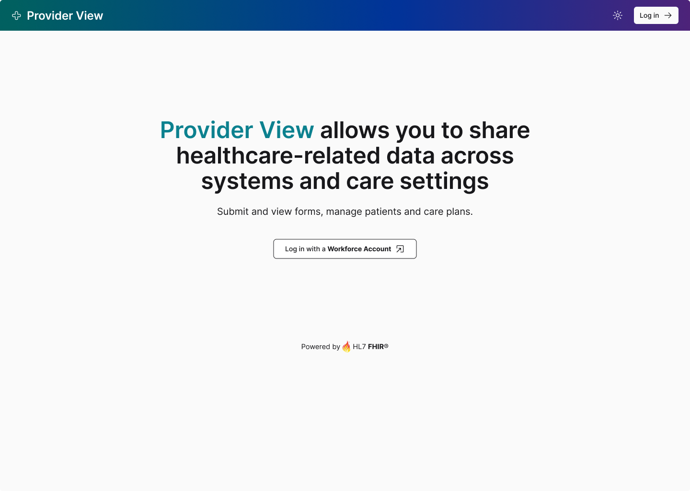
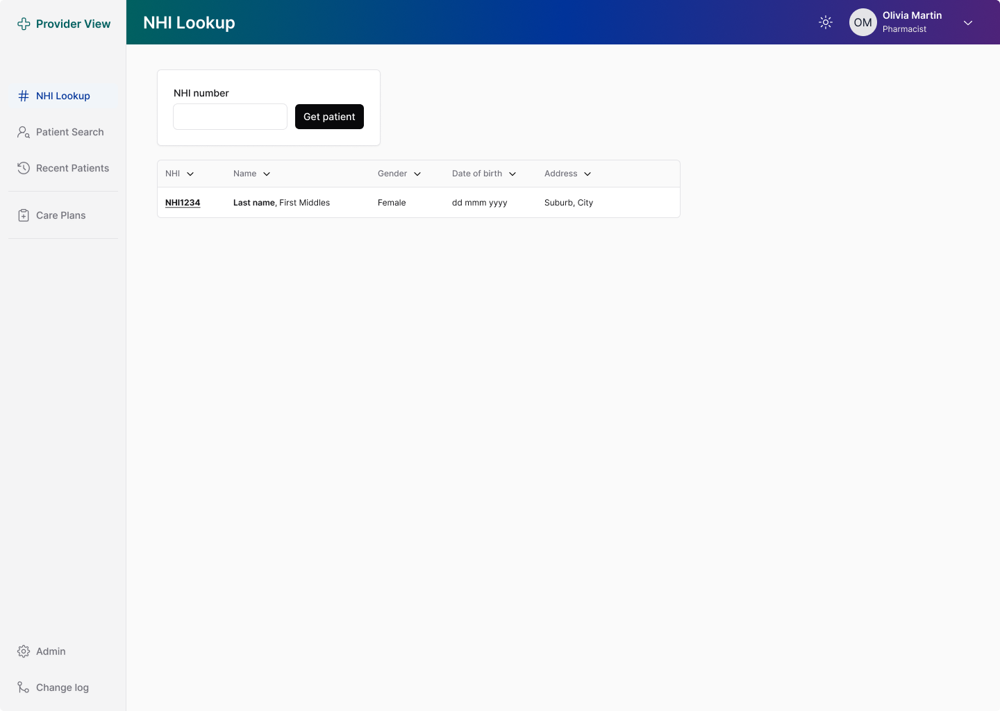
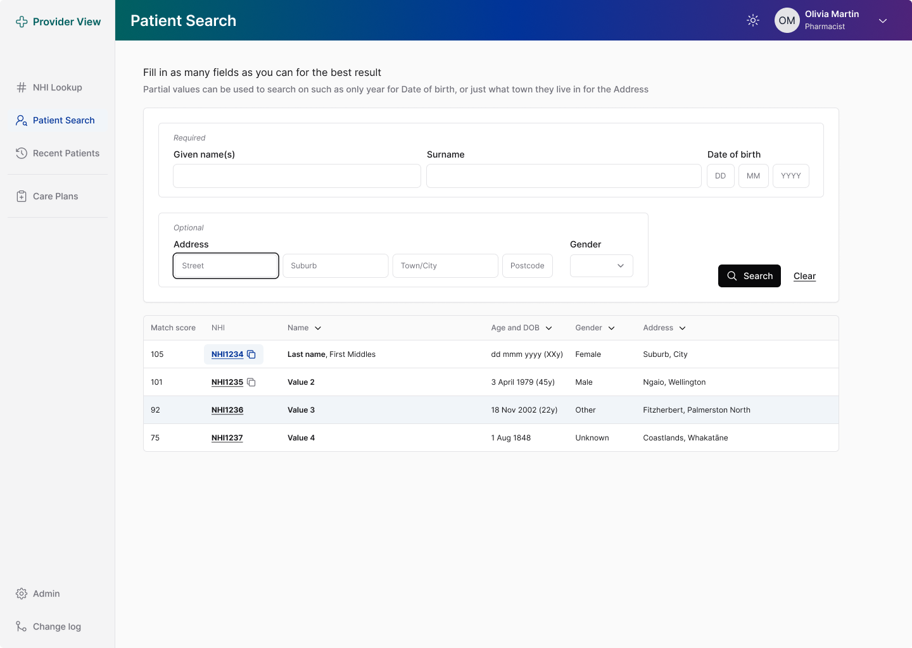
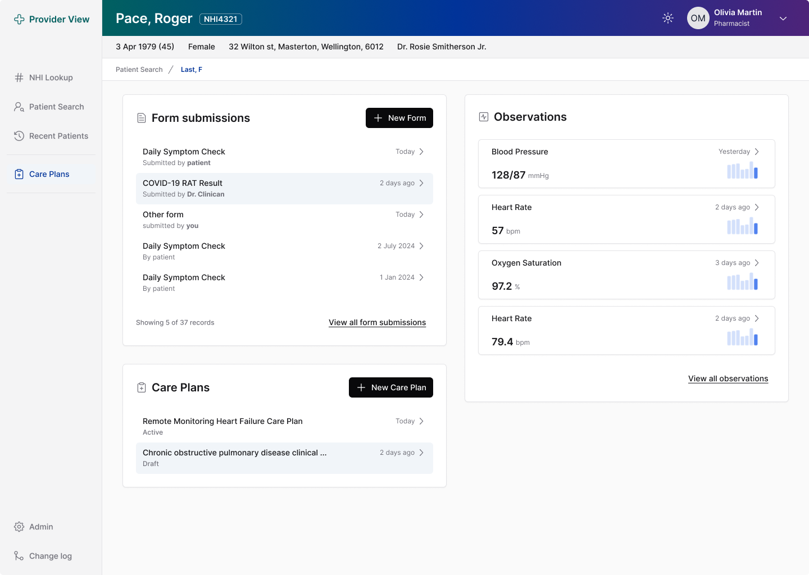
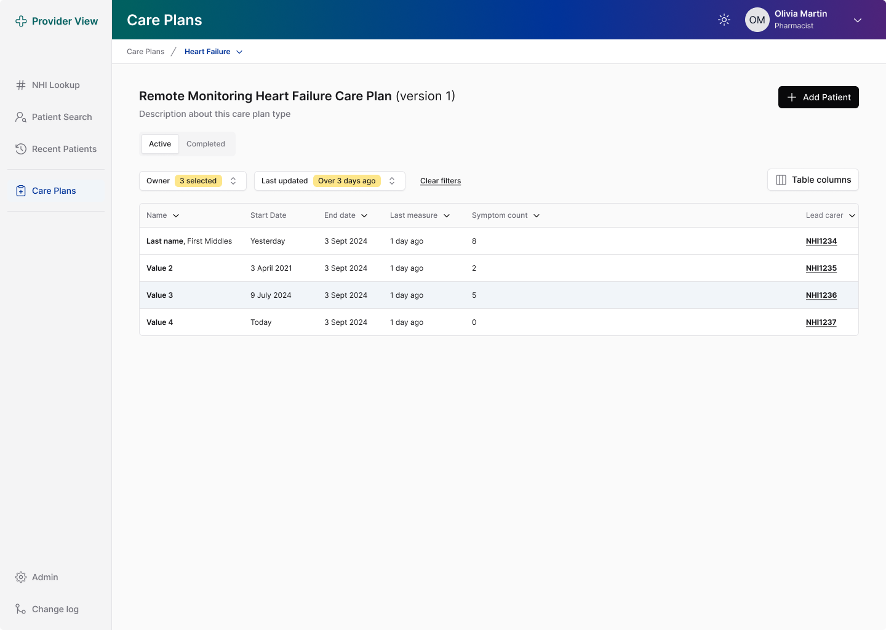
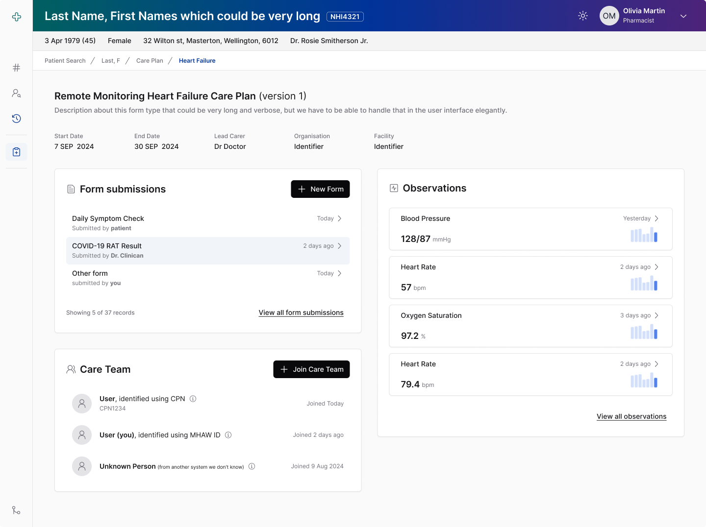
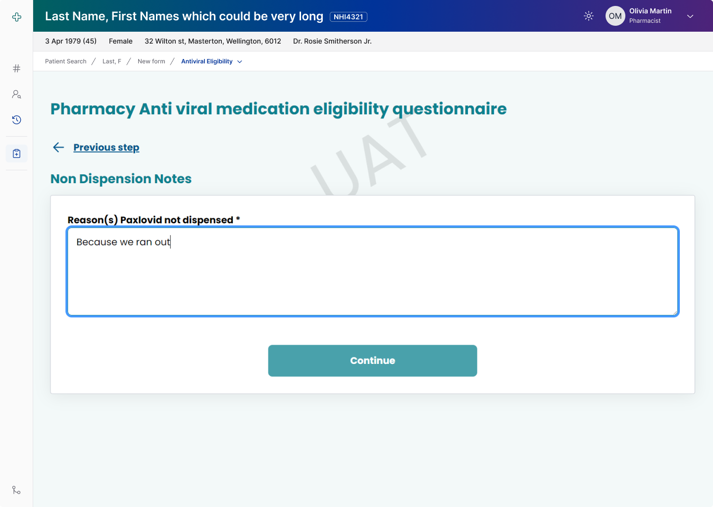
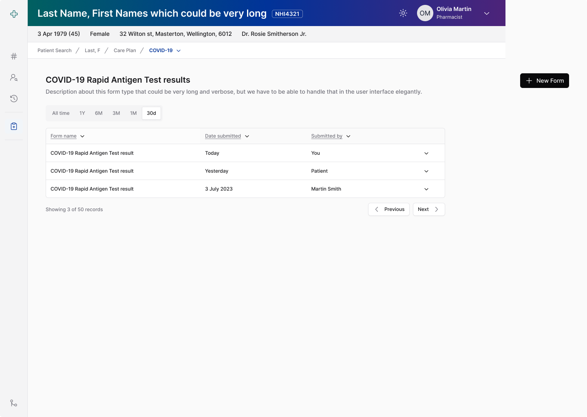
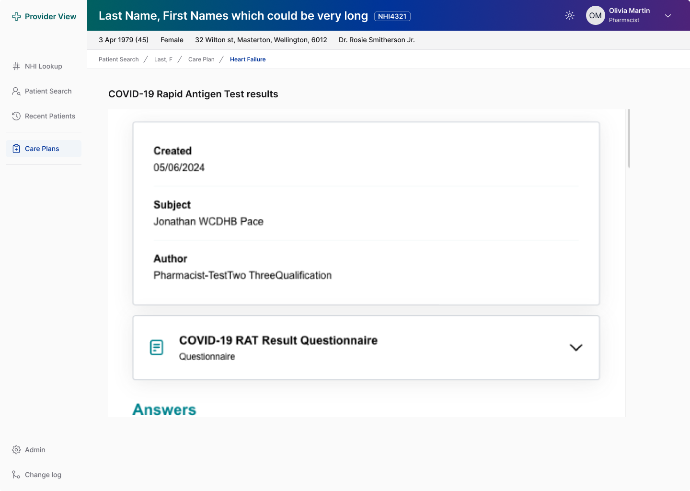
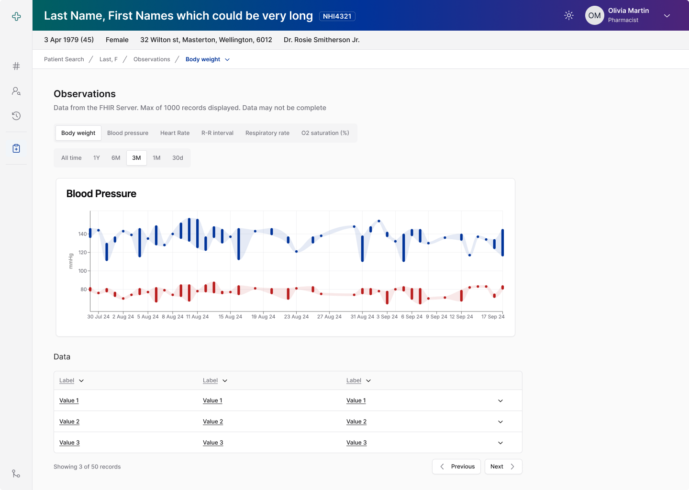

# MHR Provider View (FHIR) UI Designs (desktop)

2023-2024

Micro frontend architecture built with React on top of AWS FHIR backend. Reusable patent search and overview pages, with role based access to additional functions such as test results, observations, care plans etc.

Allows for any business unit to rapidly deploy new health forms, care plans and other digital solutions—without having to build auth, login, infrastructure from scratch. Interoperable by default.

I was Senior PO and visionary for this product - coming up with the idea, articulating what could be achieved and making it happen, instead of passively delivering the bare minimum that was asked. A highlight in may career and something I’m very proud of.

### Landing page

### Patient Lookup

### Patient Search

### Patient Summary

### Care Plans

### Embedded FHIR Questionnaire

### Test Results

### Observations

