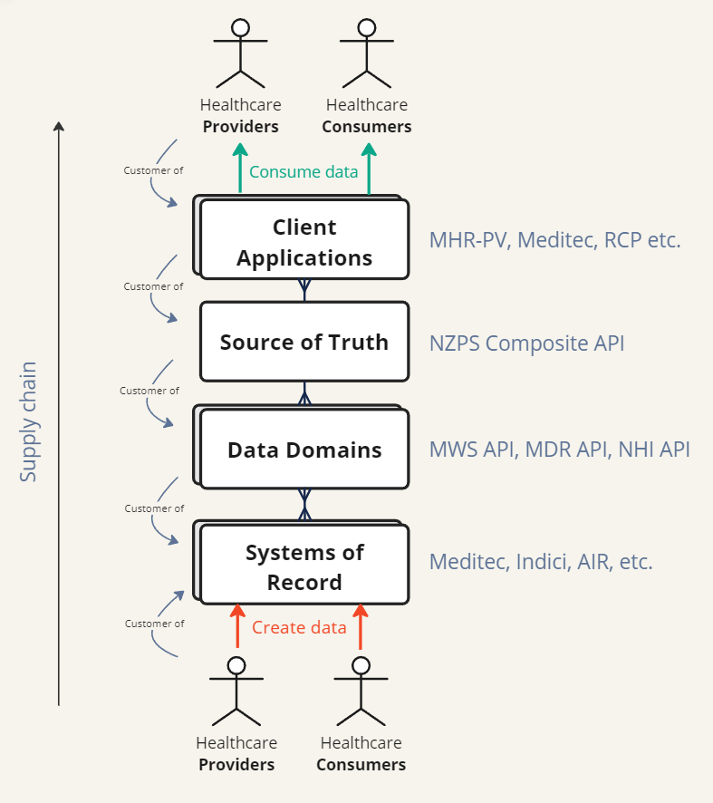

# Team profiling (topologies) and mapping the Customer-Supplier model at Health NZ

2024

With rapid growth post COVID-19, Health NZ was struggling to organise itself effectively. I initiated conversations about how we might work together better by mapping the customer supplier model, and creating basic “team APIs” for some of the teams I was involved with (from the book “Team Topologies”).

## NZPS ecosystem view

Customer Supplier model:

## NZPS API team

### Purpose:

Reduce cognitive load of front end application teams (Consuming Systems) who want to implement the NZPS, by working with the multiple Clinical operating system teams to consolidate data from their System of Records into a single Source of Truth API.

### Customers:

Client Application teams (Consuming Systems): 

1. MHRPV
2. MHR
3. PMS vendors

### Suppliers:

- System of Record API teams:
    - (list of data domain apis)

### Responsible for:

1. Populating the NZPS Composite API (Source of Truth) with data from clinical operating systems (Systems of Record).
2. Ensuring the NZPS Composite API (Source of Truth) matches as close as possible what is described in the NZPS FHIR Implementation Guide.
3. Ensuring the requirements clinical operating system (Systems of Record) have of users of their data, is met by users of the NZPS Composite API (either by meeting it on their behalf at the API level, or by ensuring the consuming systems meet them on the UI level)
4. Enabling consuming systems to easily onboard to and use the NZPS Composite API (Clear documentation and software development kit published)

### Roadmap:

1. Sequence delivery of API components to support MHRPV’s NZPS clinical view releases. 
2. Create UI standards requirements (domain accreditation and Narrative HTML use)
3. Create and clearly document a Consuming System onboarding process
4. Create Software Development Kit (SDK) for the NZPS Composite API
5. Onboarding process (sys to sys)

### Team Profile (Capabilities required)

1. Project Owner
2. Business Analyst 
3. Comms / PM
4. Developer 
5. Tester
6. (Integration team allocation)
7. (Privacy team allocation)

## My Health Record - Provider View team

### Purpose:

Make the NZPS available to as many Healthcare Providers possible.

by Create a single, national, modern web application for clinicians to access the NZPS and other FHIR features. Champion the NZPS Provider view.

### Customers:

- Healthcare Providers
- Business Units

### Suppliers:

- **NZPS API team**
- **FHIR Questionnaires and Care Plans team**

### Responsible for:

1. Creating MHRPV
2. Creating NZPS Provider View
3. Making NZPS Provider View available inside MHRPV
4. Making NZPS Provider View available for other provider applications to launch from within patient context.
5. Adding other FHIR features to MHRPV

### Roadmap:

1. (dimensions of scope?) App login, LIPC, NZPS MVP, FHIR EHR.

We are competing with other clinical systems but are also champions of the New Zealand patient summary and as such a providing a service to existing clinical systems by providing a micro front end interfaced they can launch into directly from the clinical systems minimizing their development cost to implement the patient summary

It is expected that eventually MHR-PV and NZPS-PV might split into two teams, especially if NZPS is to become a full EHR

## DEFINITIONS

1. **System of Record (SoR):**
    - **Definition**: A System of Record is the authoritative data source for a given piece of information. It is the official system where specific data is created, maintained, and stored.
    - **Purpose**: The SoR ensures that the data is accurate, up-to-date, and consistent. It acts as the primary reference point for that data.
    - **Example**: An HR system that contains employee records, or a CRM system that maintains customer information.
2. **Source of Truth (SoT):**
    - **Definition**: A Source of Truth refers to the definitive source where specific data is considered the most accurate and reliable at any given point in time. It may be derived from one or multiple systems of record.
    - **Purpose**: The SoT aims to provide a unified, consistent view of data across an organization, ensuring that all users access and rely on the same data for decision-making and reporting.
    - **Example**: A data warehouse or a master data management (MDM) system that aggregates and reconciles data from various SoRs to present a single, coherent view of the data.

**Key Differences:**

- **Scope**: SoR is specific to a particular system and its dataset, while SoT provides a holistic view of data across multiple systems.
- **Function**: SoR focuses on data accuracy within its domain, whereas SoT focuses on consistency and reliability of data across the organization.
- **Aggregation**: SoR typically does not aggregate data from other sources, but SoT often consolidates data from multiple SoRs.

Client Applications 

NZPS

NZPS-PV

MHR-PV

LIPC 

FHIR

Providers

Consumers
