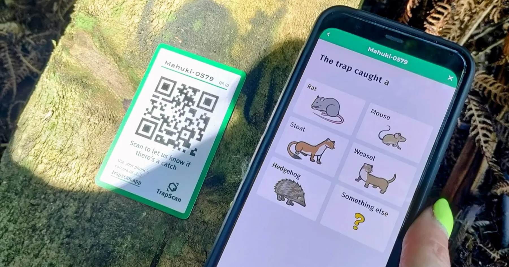
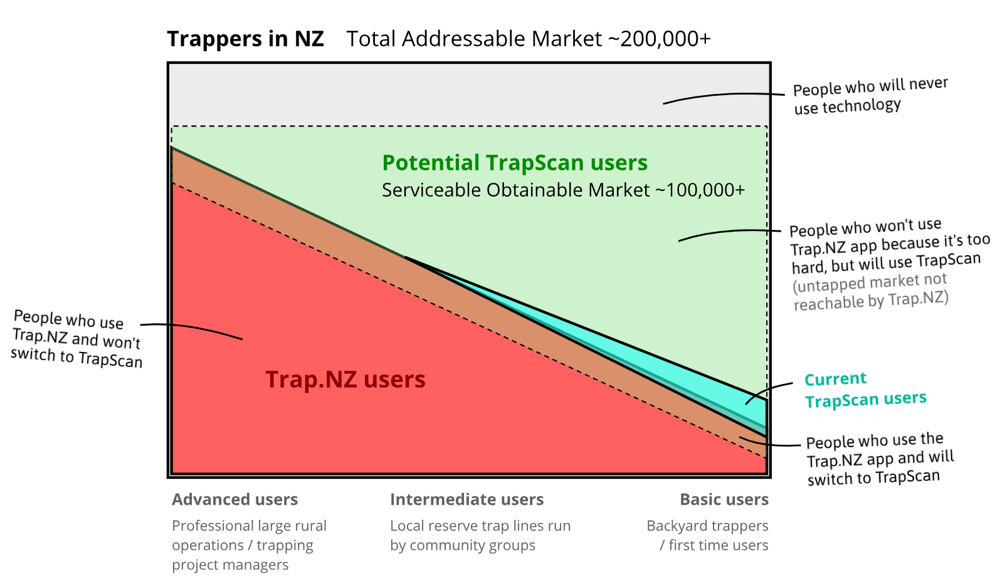
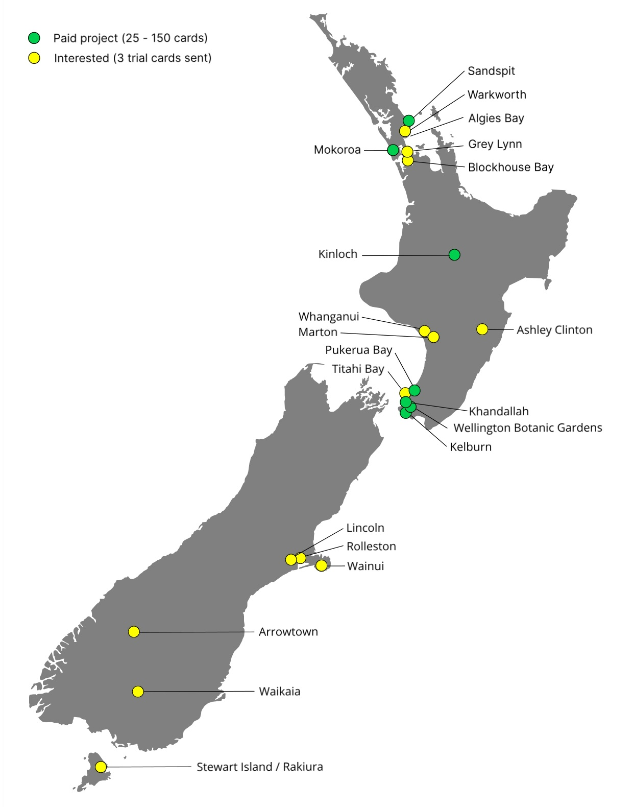
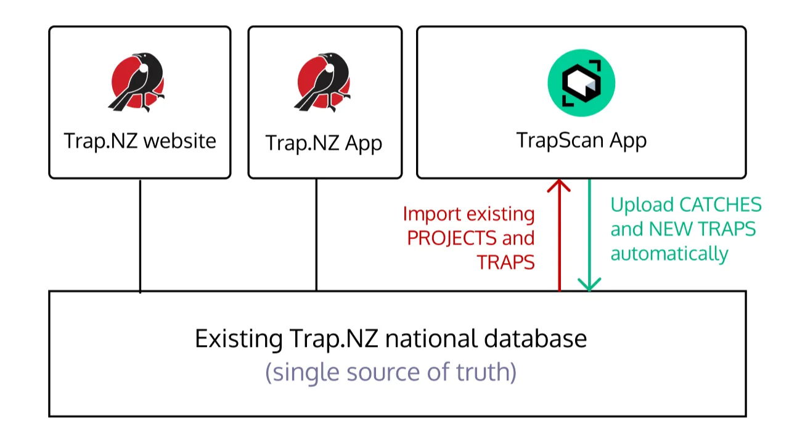

# TrapScan Business Case: Empowering Volunteers for a Predator-Free New Zealand

June 2025

## Executive Summary

TrapScan is a proven solution to scale New Zealand’s predator-free movement through a unique QR card system that simplifies volunteer onboarding, boosts engagement, and streamlines data for conservation groups. After a 4-year pilot involving Wellington City Council and Predator Free NZ Trust, TrapScan supports over **500 volunteers** across **1,000+ traps**, and has logged over **5,000 scans**. With seed funding depleted, your investment will sustain operations, and help scale to more conservation volunteers across the country who desperately need the help this technology provides.

## Why Invest Now?

Without funding by late 2026, TrapScan risks shutting down, stranding **500+ volunteers** and wasting four years of proven development. The conscription of our Ukrainian developer adds urgency to migrate to a New Zealand-based team. Your investment will scale TrapScan to support **thousands of trappers** nationwide, unlocking **millions of administration hours** for managers and volunteers alike in the mission towards a Predator Free New Zealand. Every dollar enhances volunteer engagement, protects native species, and strengthens funding bids for local projects.

## Market Opportunity

New Zealand’s predator-free movement has over **200,000 volunteers** (Morton, 2017) across over **2,000 community groups** (Predator Free 2050, 2024) that manage hundreds of thousands of traps.

Most investment to date has focused on trap development, with almost none allocated to project and data management tools, or supporting recruitment and engagement of volunteers.

→ **TrapScan is that investment in data and project management**

Trap.NZ is the only other existing solution, but is designed for advanced users and large rural traplines. Trap.NZ’s features are not suited for backyard trapping communities.

### Addressable Market

## TrapScan Adoption Map

TrapScan has interest from all over the country, but currently only serves 0.1% of the projects Trap.NZ does. This shows there is plenty of room to grow.

## Problems TrapScan Solves

1. **No Clear Entry Point**: Unmarked traps are a missed opportunity for potential volunteers to get involved - there is no easy way to join. (Low lead generation)
2. **Complex Onboarding**: Trap.NZ’s app deters interested volunteers with complex sign-ups. (low conversion rate)
3. **Inefficient Reporting**: Coordinators waste multiple hours every week chasing data via emails/spreadsheets. (Low reporting rate, low efficiency, low retention)
4. **Low Engagement**: Without real-time feedback, volunteers turnover is high with most disengaging within 6 months. (low retention)
5. **Weak Funding Bids**: Poor data reduces successful funding applications for projects. (low survival rate)

## Solutions TrapScan Provides

1. **Visible Entry Point**: QR cards invite anyone to scan and join instantly, boosting sign-ups.
2. **Seamless Onboarding**: Scan-and-go system allows volunteers to contribute immediately, and acts as a front door to joining their local project.
3. **Easy Catch Reporting**: QR scans log catches in seconds, syncing to Trap.NZ, saving multiple hours for all trappers, and increasing reporting rates.
4. **Engaging Feedback**: Real-time stats and charts show impact, improving engagement and retention - it makes volunteers feel part of something bigger.
5. **Strong Funding Reports**: Complete and high quality data boosts funding success for projects. 

A short [TrapScan product overview video](https://www.youtube.com/watch?v=Gk8rcPV3u6Q) is available on YouTube.

## Extension of Trap.NZ — not a direct competitor.

**Trap.NZ** is a government-funded, national pest control database started in 2019 that has over 8500 trapping projects using it already. It is a secure, industrial-grade platform with strong adoption by conservation groups, councils, and government agencies. Its robust infrastructure and API support make it a trusted central repository for trapping data.

**TrapScan** integrates seamlessly with [Trap.NZ](http://trap.nz/), saving all trap check data directly to the national database. Existing projects and traps can be easily imported, enabling fast, frictionless onboarding.

This ensures all trapping data ends up in the same place, regardless of which app is used. Projects can switch between tools without risking data loss or dealing with complex migrations.

---

## User Testimonials

> Current setups are a lot of faff for backyard trappers. I want people getting more involved, recording the data and being more active with each other and in their group and wider community. That's why we want TrapScan.
>
> — **Biosecurity Lead, Wellington City Council**

> TrapScan is a gamechanger! Now I'm going to be able to actually manage the 400 traps and members I have out in this suburb, especially when users can start to request and return traps.
>
> — **Khandallah Project Manager**

> I’ve got a science research background so am suitably appalled others are totally ok with under-reporting & big data gaps. My team is on board with QR codes because they’ve all struggled to use [Trap.nz](http://trap.nz/) for their own home traps!
>
> — **Tamahere Project Manager**

> It's not just "nice" to see accurate data of your progress, it's important otherwise people get dis-empowered, so it’s great to see TrapScan displays project results graphs directly to our volunteers.
>
> — **Wellington Botanic Gardens Project Manager**

> See, I like saving all of my checks now - even the ones with nothing caught, because it's so easy and satisfying when you see the "Success" screen at the end. I honestly believe this will make a huge difference to the country.
>
> — **Kelburn Project Manager**

## Two-person team

TrapScan was designed from the ground up by **Kurtis Papple**, a single volunteer who saw the need for a better way of recording trap checks and managing data. He developed a prototype, secured seed funding, found a developer in Ukraine offering reduced-price services, and built the app. Kurtis handles research, user requirements, UI design, data modeling, development management, testing, documentation, user guides, QR card stock, onboarding, and troubleshooting.

---

## Funding Request: Three Options

### 1. Keep the Lights On ($16,655 total over 3 years)

Sustain operations for the next 3 years. This de-risks the current infrastructure setup by handing over to NZ development company, fixes a few small but critical bugs, and covers base operating costs, to give time for natural, self-sustaining growth to occur.

| Initial handover to Springtimesoft and major software updates | $10,000 + GST ($11,500) |
| --- | --- |
| Support initial handover (Kurtis) | $1,400 + GST ($1,610) |
| Monthly minor software updates and patching for 6 months (spread across the 3 years) | $2,700 + GST ($3,105) |
| Web hosting costs | $900 ($300 /y) |

### 2. Scale and stabilise ($38,060)

In addition to keeping the product operational, this option bootstraps adoption by giving a small marketing budget *and* subsidising QR cards for new projects. In addition, some small in-demand enhancements will be made to the app.

| Everything from option 1 | $16,655 |
| --- | --- |
| Monthly minor software updates and patching for an *additional* 6 months (12 total) | $2,700 + GST ($3,105) |
| Basic Feature development (top 1-2 small features only) | $5,000 + GST ($5,750) |
| Requirements and design for basic feature development (Kurtis) | $2,000 + GST ($2,300) |
| Marketing | $2,000 |
| QR card subsidies (the next 1500 cards sold are 80% off; pack of 25 costs $10 instead of $50) | $2,500 |
| Onboarding and technical support for new projects (2 hrs per week to deal with demand generated by marketing and reduced-cost QRs) | $5,000 + GST ($5,750) |

### 3. National Backbone ($72,260)

Become NZ’s go-to conservation tool by supercharging development; there are over 20 good ideas to improve TrapScan (Appendix B), many of which could have a profound impact on the ultimate goal of protecting our native species. This option allows us to turn some of these ideas into reality for all of our incredibly self-less volunteers across the country.

| Everything from option 1 and 2 | $38,060 |
| --- | --- |
| Advanced Feature development (top 5-7 features of any size) | $20,000 + GST ($23,000) |
| Requirements and design for advanced feature development (Kurtis) | $8,000 + GST ($9,200) |
| More marketing | $2,000 |

Your investment is greatly appreciated and ensures TrapScan’s survival, scalability, and transformation into a national asset, empowering volunteers and protecting native species.

---

## Appendix A: Springtimesoft letter of support for TrapScan

10 June 2025

TrapScan

By email: kurtis@trapscan.app

Attention: Kurtis Papple

Springtimesoft Consulting Ltd
PO Box (redacted)
New Zealand

Dear Kurtis,

**Letter of technical support**

We understand that TrapScan is looking to continue to develop your app/product including applying important software updates and prioritised feature development. Our experience with the technical stack in use means we have the capability to support TrapScan with product development.

Following our meetings and code review we have a clear understanding of both what is required technically and TrapScan’s feature roadmap. Estimates for these activities are included below:

| **Activity** | **Estimate** |
| --- | --- |
| Initial major software updates | $8,000 - $10,000 + GST |
| Monthly minor software updates and patching | $450 + GST per month |
| Feature development | To be confirmed following major software upgrades. |

This project has our full support and we look forward to working with you.  If you require anything further please feel free to contact me.

Kind regards,

Perrin Reilly, Director, Springtimesoft Consulting

---

## Appendix B: TrapScan Improvement Proposals

| **#** | **Feature Name** | **Description** | **Size** | **Benefit / Outcome** |
| --- | --- | --- | --- | --- |
| 1 | **Offline Mode** | Log catches without cell coverage; syncs when online | Medium | Ensures data capture in remote areas, saves South Island project |
| 2 | **Native Mobile App (iOS/Android)** | Rebuild as downloadable app with web version for better compatibility | Large | Improves user experience, enables push notifications and offline mode |
| 3 | **Bulk Trap Updates** | Update multiple traps (e.g., “no catch”) without individual scans | Small | Speeds up reporting for large trap lines |
| 4 | **Public Website Real-Time Stats Dashboard** | Show personal/project catch totals, trends, and enhanced visuals instantly | Medium | Boosts volunteer motivation, strengthens funding bids with better data visuals |
| 5 | **Public Dashboard** | Public webpage where anyone can view totals and charts of catches, traps, and contributors over time, for all of TrapScan, by project/region or even by trap | Medium | Makes reporting extremely easy as can link anyone to your dashboard. Transparency of trapping in NZ |
| 6 | **Sponsor a Trapper** | Map of public traps; users donate (one-off/subscription), add note, name trap | Medium | Raises funds, engages public, increases trap network visibility |
| 7 | **Leaderboards** | Rank volunteers/projects by catches (local or national) | Medium | Drives engagement through friendly competition |
| 8 | **Contributors Tracking** | Auto-track active/all-time contributors via scans | Small | Recognizes effort, fosters community visibility |
| 9 | **Push Notifications** | Send reminders or alerts (e.g., “Check traps!”) | Medium | Keeps volunteers active, requires native app |
| 10 | **Nearby Traps Map** | Map 5 closest traps with GPS-based pop-ups | Medium | Speeds up trap checks, especially for new lines |
| 11 | **Roster and Reminders for Trap Lines and Working Bees** | Rosters can be created, people can join them, reminder and gap notifications | Medium | Helps project coordinators manage rosters which are time-consuming |
| 12 | **Trap Line Check-In** | Log trap line run times, suggest next trap, bulk-update unchecked traps | Medium | Streamlines group efforts, tracks efficiency |
| 13 | **Default Baits** | Set default bait per trap type to auto-fill during scans | Small | Saves time on repetitive inputs |
| 14 | **Trap Status and Fault Reporting** | Flag traps needing maintenance/overdue checks; add “report issue” button | Small | Helps coordinators prioritize fieldwork, improves data quality |
| 15 | **Auto-Grouping by Region** | Group traps by area (e.g., Wellington) using LINZ/What3Words | Large | Simplifies regional stats for funding and analysis |
| 16 | **Augmented Reality (AR) Trap Locator** | Overlay trap locations via camera, using LINZ LiDAR for accuracy | Large | Helps find traps in dense bush, improves user experience |
| 17 | **Chat AI Integration** | AI answers data queries (e.g., “How many rats this month?”) | Large | Makes data accessible, reduces coordinator workload |
| 18 | **Coordinator Dashboard** | View all traps, volunteers, catches; includes onboarding tools | Large | Eases management as projects scale |
| 19 | **Onboarding Wizard** | Guide coordinators to register traps and distribute cards | Medium | Supports rapid scaling without direct oversight |
| 20 | **Code Cleanup and Reskin** | Refactor code, switch to React, redesign with Shadcn UI | Large | Future-proofs app, speeds up updates, improves usability |
| 21 | **Project info and Join Instructions on QR scan** | When a non-trapper scans the QR out of interest, there is information about the project and how to get in touch | Medium | Better conversion of curious non-trappers |
| 22 | **Return a trap by scanning QR** | When someone doesn't want their trap anymore, or a trap is found, person can scan and notify PM of return request and location | Medium  | Improved asset management (who knows how many idle traps are out there because people don't have a pathway of returning?) |

---

## Appendix C: Previous Investments TrapScan has received

| 2021 | Predator Free Wellington | $5000 |
| --- | --- | --- |
| 2021 | Wellington City Council | $5000 |
| 2022 | Wellington City Council | $5000 |
| 2022 | Kelburn Conservation Network | $2500 |
| 2023 | Clare NZ | $10,000 |

---

## Appendix D: Jobs of a trapping Project Manager

Managing backyard trapping projects requires far more work to be successful than just setting traps. TrapScan aims to help project managers to do their jobs easily.

Below is an overview of all the types of work they do:

---

## References

- Latham, A. D. M. (2019, June 25). Part of something bigger: The social movement around New Zealand’s Predator-Free 2050 goal. Mongabay. [https://news.mongabay.com/2019/06/part-of-something-bigger-the-social-movement-around-new-zealands-predator-free-2050-goal/](https://news.mongabay.com/2019/06/part-of-something-bigger-the-social-movement-around-new-zealands-predator-free-2050-goal/)
- Morton, J. (2017, November 12). Predator-free movement uniting communities and organisations. Stuff. [https://www.stuff.co.nz/environment/99155127/predator-free-movement-uniting-communities-and-organisations](https://www.stuff.co.nz/environment/99155127/predator-free-movement-uniting-communities-and-organisations)
- Predator Free 2050. (2024, September 22). In Wikipedia. [https://en.wikipedia.org/wiki/Predator_Free_2050](https://en.wikipedia.org/wiki/Predator_Free_2050)
