# TrapScan Branding and UI Design (mobile)

2022-2023

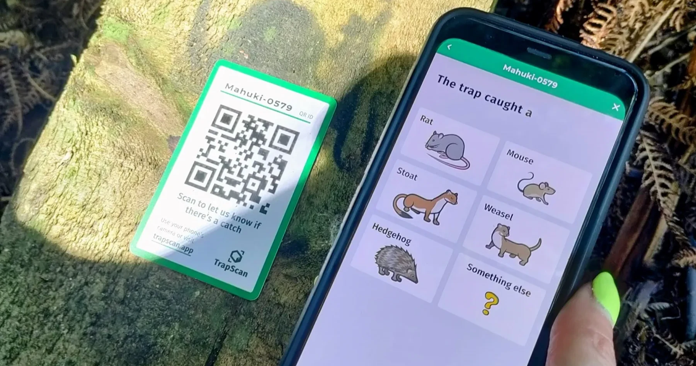

### Use case and QR Card design:

New Zealand’s unique native birds and lizards are rapidly becoming extinct due to introduced mammals decimating them. Thousands of volunteers across the country trap these rats, mice, stoats and weasles in hopes of giving the defenseless native species a chance at life. Managing the work and reporting is a headache, so TrapScan makes it easy with unique QR cards and a user-friendly web-app that can be used without an account

Read about TrapScan here: 

[TrapScan Business Case: Empowering Volunteers for a Predator-Free New Zealand](../trapscan-business-case/)

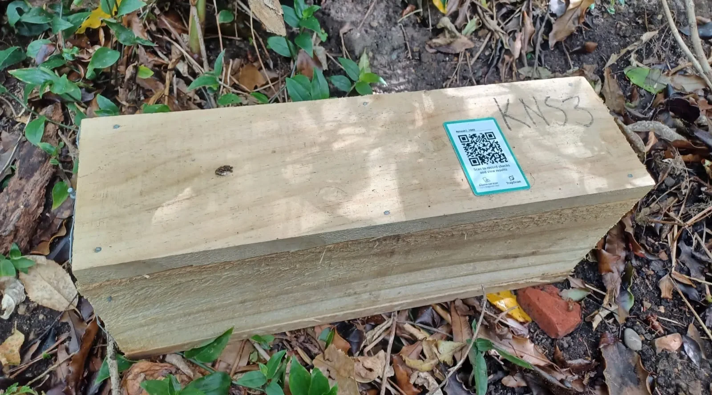

### Scan flow:

This step form is modeled off real conversations trappers have with each other when checking traps, which makes the questions and answers available feel extremely intuitive, lowering cognitive load.

No long forms, no scrolling, no typing, no popups. Just large, easy-to-press buttons and only four screen taps to record a trap check (compared to competitor [trap.nz](http://trap.nz/) that requires 10+ screen taps to capture the same amount of data).

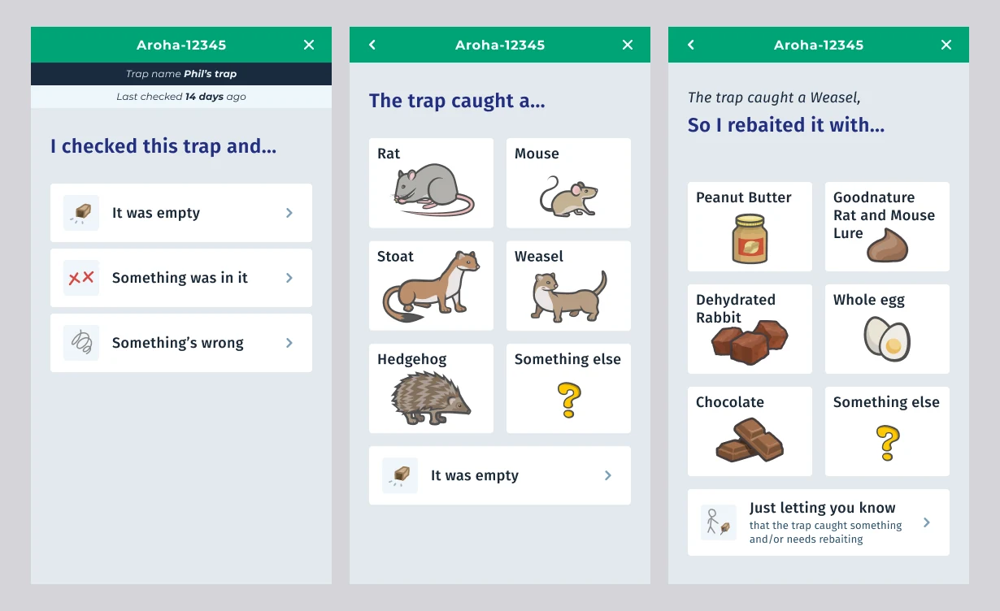

### Data capture model:

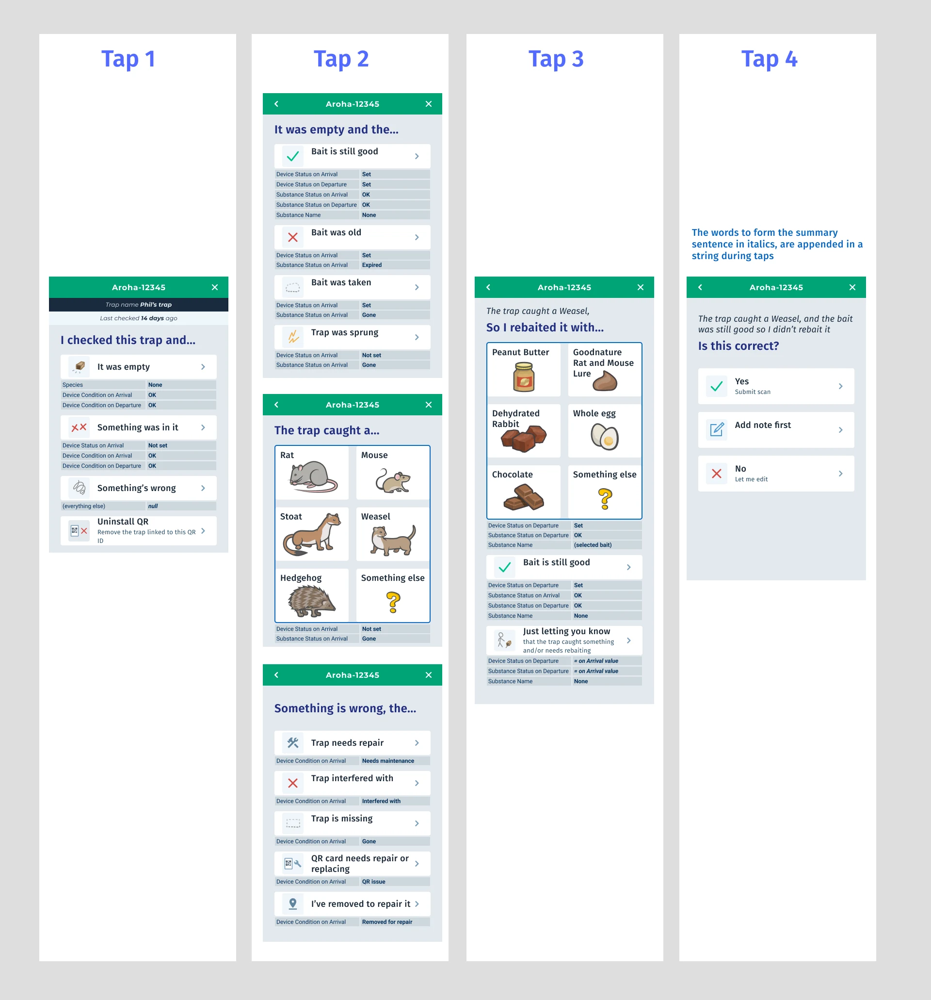

### Manual QR ID entry:

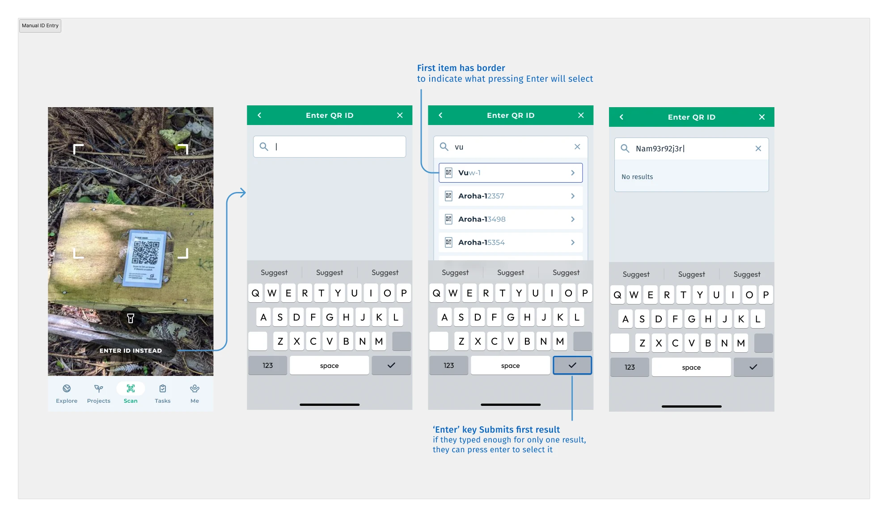

### “Anyone can scan” (no login required):

This was a huge pain point discovered: people just won’t login no matter how easy you make it for them. The audience is mostly retirees, so it’s understandable. Allowing anyone to record trap checks is a “security” trade-off trapping project coordinators were willing to make— this isn’t financial data, they’d rather people report than have fool-proof quality assurance. 

As a bonus, it means anyone out for a walk who sees something in a trap, can scan the card to let the project manager know!

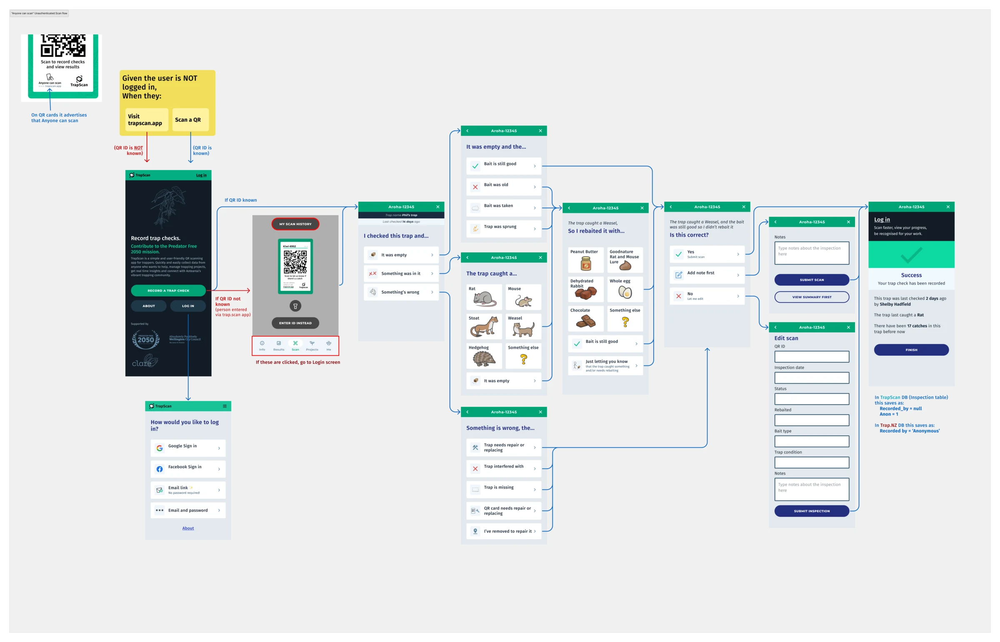

### Login flow:

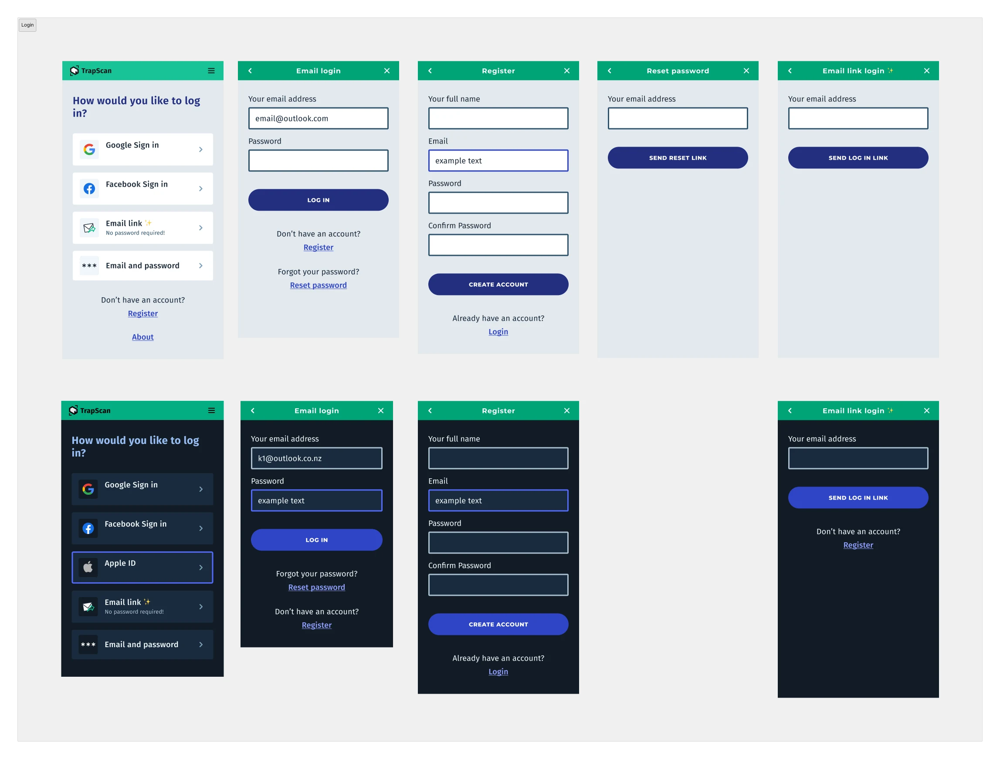

### Delete a Trap that has a QR attached (exception handling):

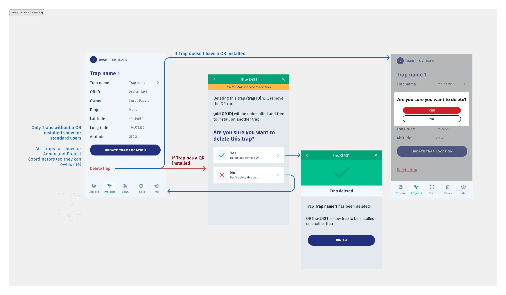

### Uninstall QR card:

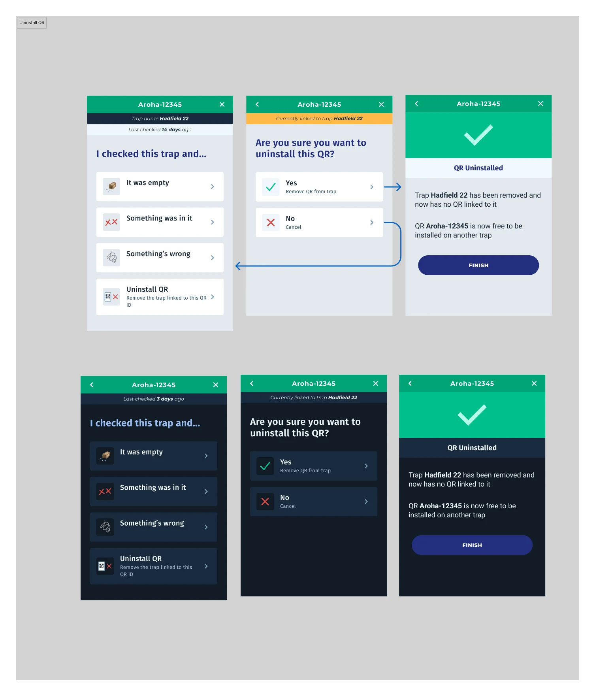

### View and Manage a trapping Project:

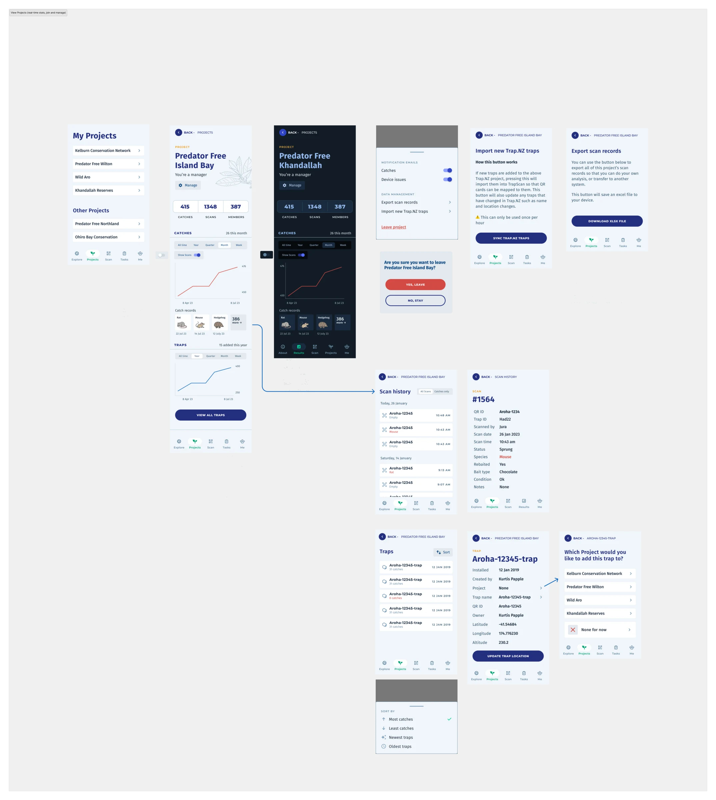

### Create a trapping Project:

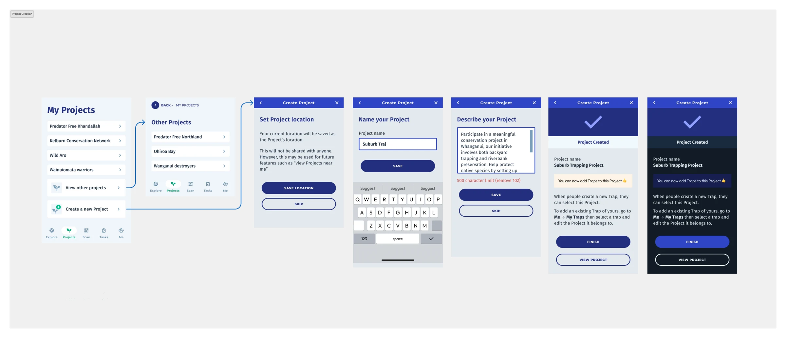

### Join TrapScan (membership payment flow):

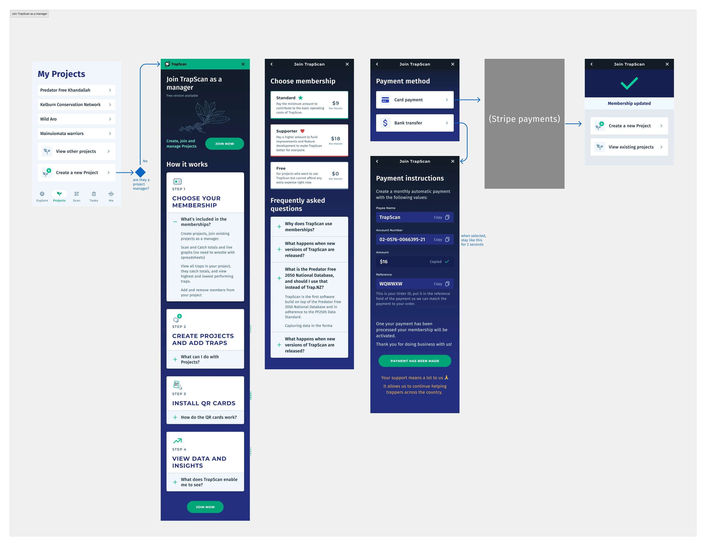

### Trap Line check-in and bulk-complete:

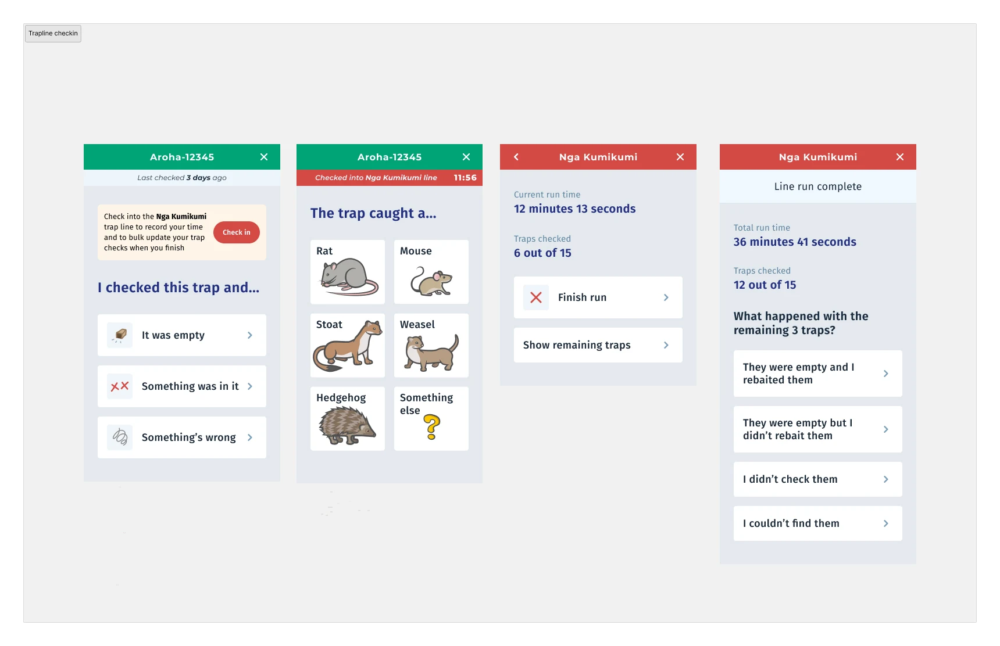

### Scan History:

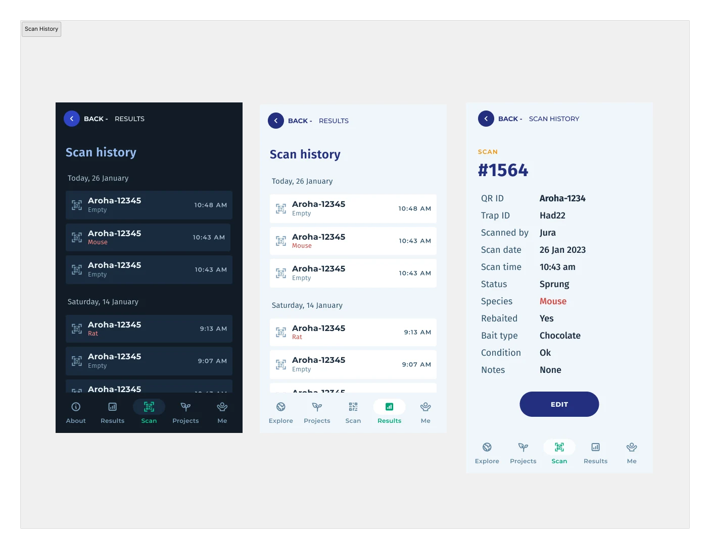
